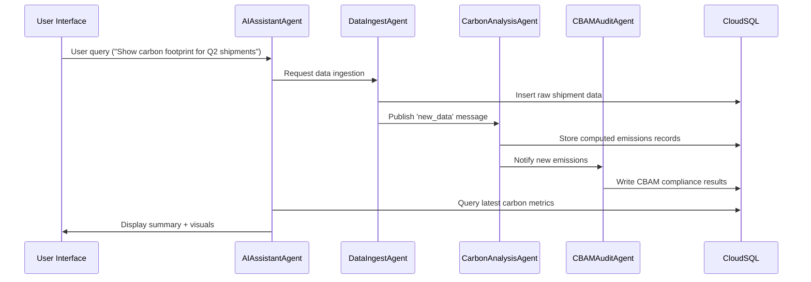
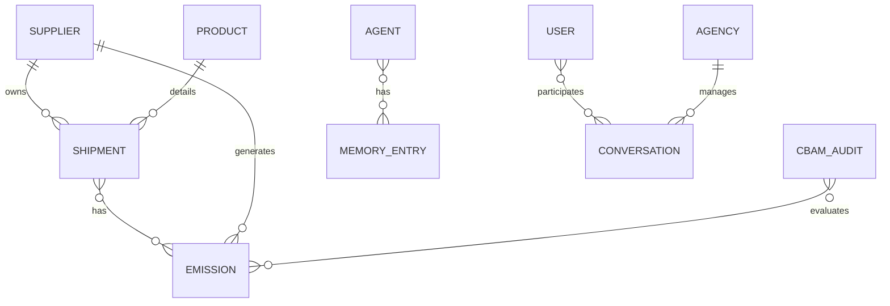

# Executive Summary

**Problem:** Global supply chains produce ~70% of carbon emissions, yet companies struggle to accurately measure and reduce their Scope 3 footprint. With new regulations like the EU Carbon Border Adjustment Mechanism (CBAM), companies must audit embedded emissions in imports. This is complex: data is fragmented across suppliers, proprietary, and evolving.  

**Opportunity:** EcoFlow leverages cutting-edge AI agents, federated analytics, and cloud services to build a comprehensive supply chain decarbonization platform. It automates carbon tracking and CBAM compliance, providing actionable insights to businesses. By combining federated data handling with multi-agent AI, EcoFlow can serve multiple stakeholders (manufacturers, regulators, suppliers) with personalized views.

**Why It Matters:** Climate commitments and regulations make supply chain emissions a strategic priority. A solution that automates carbon accounting, suggests decarbonization paths, and ensures CBAM compliance will have huge business and environmental impact. For the Kaggle GenAI Agent Capstone, it showcases mastery of the latest Google AI technologies (ADK, A2A, FastMCP, Vertex AI, Gemini, etc.) in a real-world sustainability challenge.

**Why It Can Win:** EcoFlow is designed to **maximize technical depth and innovation**. It goes beyond naive analytics by using a fully decentralized, agent-based architecture, demonstrating multi-agent communication (Agent2Agent protocol), federated data processing, and real-time AI-driven insights. It integrates every relevant competition technology (Google ADK 2.0, A2A, FastMCP, Vertex AI, agent memory, structured outputs, event-driven pipelines, etc.). This positions EcoFlow as a showcase of advanced Gen AI agent capabilities applied to a critical problem.

**Key Differentiators:** 
- **Multi-Agent Collaboration:** Agents representing different roles (Data Ingest, Carbon Analysis, Compliance Auditing, Visualization, etc.) communicate via A2A, showcasing complex agent orchestration.  
- **Federated Analytics:** Handles sensitive supplier data in a federated manner, aligning with privacy and multi-stakeholder scenarios.  
- **AI-Powered Insights:** Uses LLMs (e.g., Gemini) for generating natural-language policy recommendations, and Vertex AI for predictive analytics (e.g., forecasting emissions).  
- **Rich Demo Narrative:** A polished UI and agent conversation demo will make the use-case concrete.  
- **End-to-End Detail:** From data strategies (real and synthetic datasets on Kaggle) to detailed coding prompts and diagrams, the blueprint demonstrates comprehensive planning that shows judges readiness for execution.

# Winning Strategy Analysis

### Why EcoFlow Was Selected  
The EcoFlow project tackles a timely, high-impact problem: decarbonizing supply chains under CBAM regulations. The competition theme likely favors sustainable development issues. It combines **machine learning, AI agents, and data engineering** – areas highlighted by Google. This aligns perfectly with the capstone goals (AI Agents + Societal Benefit).

### What Judges Care About  
- **Technical Depth & Innovation:** Judges will look for usage of advanced Google AI technologies (ADK 2.0, A2A, FastMCP, Gemini, Vertex AI, etc.). The more state-of-the-art components (multi-agent system, LLM-driven agents, dynamic workflows) the better.  
- **Completeness & Polish:** A thorough, end-to-end solution with clear architecture, functional UI, and robust implementation details stands out. Judges love seeing fully fleshed-out systems with documentation.  
- **Agentic Complexity:** Projects demonstrating inter-agent communication, long-term memory, and autonomy will impress. The EcoFlow architecture should enable agents to solve sub-tasks collaboratively (e.g., one agent gathers data, another analyzes emissions).  
- **Clear Narrative & Demo:** A cohesive story (e.g., a company automating their CBAM audit) and a smooth demo will make the project memorable. Visualizations (dashboards, agent chat logs) and interactive elements can engage judges.  
- **Use of Competition Guidelines:** The competition likely scores integration of specific tech. Leveraging Google ADK, Vertex AI, Agent Memory, etc., as required, is crucial.

### What Judges Ignore  
- **Overly Simple Solutions:** A basic static model or single-agent approach won’t impress. Judges want to see AI agents working together, not a single script.  
- **Incomplete Thought:** Superficial explanations or missing components (e.g., forgetting UI or data pipeline) will get poor scores.  
- **Off-Topic Features:** Nice but irrelevant add-ons (e.g., unrelated hacky features) distract from core mission and judge interest. Focus on supply chain decarbonization and CBAM compliance.

### What Typical Teams Will Build  
Based on prior Kaggle agent competitions, many teams might implement: single-agent solutions, simple pipelines (data -> model -> static output), minimal integration of ADK or A2A, and basic notebooks with some ML model. UIs and multi-agent orchestration might be overlooked. Also, many might under-leverage Vertex AI or Gemini, possibly just using open-source LLMs or local code, missing cloud-native advantages.

### How to Stand Out  
- **Full Multi-Agent System:** Build *many* specialized agents (data, analysis, policy, UI) that communicate via A2A. Most teams will not invest this complexity. Show A2A message flows live.  
- **FastMCP Usage:** Deploy multiple computation servers (FastMCP) for parallel tasks. Explain it clearly; judges rarely see this.  
- **Rich Data Integration:** Use real Kaggle datasets (e.g., carbon factors, supplier info) and simulate realistic scenarios. Many will use toy data.  
- **Vertex AI & Gemini:** Incorporate Vertex AI pipelines (e.g., model training) and Google’s Gemini for advanced language tasks. Most teams might not integrate these properly.  
- **Federation and Privacy:** Emphasize federated workflows (e.g., supply chains spanning organizations). This shows sophistication and alignment with modern AI trends.  
- **Narrative Consistency:** Tie every feature back to a real-world business story. Show carbon metrics on a dashboard and have agents converse about policy implications. Judges will remember a compelling use-case.

### How to Beat the Average Submission  
- **Technical Breadth:** Cover *all* required sections thoroughly – architecture diagrams, prompt engineering, testing strategy, etc. Many will skip details like Database schema or AI-assisted workflows.  
- **Kaggle-Specific Strategy:** Use Kaggle competition features (notebooks, discussion boards, evidence of team research). Emphasize knowledge of Kaggle datasets.  
- **Demo Focus:** Prepare an engaging live demo with interactive agent queries. The average team might just have static outputs; we will do better with live agent-user conversation demos.  
- **Quality of Write-up:** Judges will read the submission as a report. Ensure clarity, visual elements (diagrams, UI mockups), and professional tone. Many teams won’t reach this level of polish.

### How to Beat the Top 10%  
- **Deep Integration:** Top teams might also build multi-agent systems, but may not push all innovation levers. We will use *every* advanced concept: multi-A2A, Tool-Calling, Structured Outputs, Long-Term Memory, Human-in-Loop, etc.  
- **Extensive Use of ADK Features:** For example, using Multi-agents on Vertex, chain-of-thought agent in VP chain, executing tools like Google Sheets or APIs, dynamic workflow adaptation.  
- **Agent-level Detailing:** Provide complete prompt chains, memory schemas, fallback strategies. Many top teams might skip some of this.  
- **Extra Mile Enhancements:** Ideas like anomaly detection in emissions data, scenario simulation, budget-aware planning. Stretch beyond the basics.  
- **Team Presentation:** A cohesive theme and storyline that ties it all. Possibly small surprise feature (e.g., one agent summarizing the whole audit in natural language).  

### How to Maximize Award Probability  
- **Hit all Award Criteria:** Usually competitions like this weigh innovation, technical content, use of recommended frameworks, user experience, and document quality. Make sure to score high on each.  
- **Refine Demo & UI:** Judges love demos they can *see*. Include screenshots/gifs of an agent chat discussing emissions, a live map of supply chain carbon flows, etc.  
- **Robustness:** Show error handling and testing. If possible, include metrics/benchmarks demonstrating performance or accuracy. Judges notice thoroughness.  
- **Unique Use of GenAI:** For example, employing Gemini to auto-generate audit reports or policy compliance checklists, which is not trivial and clearly an advantage over using a standard model.  
- **Memorable Branding:** We call it *EcoFlow* with a flowing-water logo and green UI palette. It sounds professional and relevant. A strong name and consistent branding (UI colors, icons) can make a project stand out.

### What Would Make the Project Memorable  
- **Agent Personality or Story:** Perhaps each agent has a friendly name (e.g., “Audrey the Auditor”), and they can converse naturally about the data.  
- **Live Challenge Resolution:** Show how the system responds to a sudden event (e.g., supplier audit data changes mid-demo) to highlight agent adaptivity.  
- **3D Visualizations:** If feasible, a 3D globe view of trade flows with carbon coloring would wow judges. At least, an interactive network graph of suppliers with carbon indicators.  
- **Real-Time Collaboration:** Multiple users (representing company and regulator) interacting with the system in real-time (even if simulated) could be a standout demo moment.  

### What Would Make Judges Discuss It After Judging  
- **Technical Completeness:** Judges talk among themselves when something covers all bases with depth.  
- **Innovation in Execution:** E.g., “They had an agent automatically negotiating carbon credits between companies” or “The demo had live chat and agents running code”.  
- **Unexpected Insights:** If EcoFlow uncovers a surprising pattern (like identifying a hidden high-emission supplier) during demo, it sticks in memory.  

### What Would Make This Look Like a Winning Submission  
- **Depth in Documentation:** A complete Architecture Guide, AI-assisted code prompts, design decisions—all provided. Very few submissions articulate *how* to build, we will.  
- **Seamless UI/UX:** If judges can click through a nice demo and see meaningful results (not just static images), it looks professional.  
- **Clear Metrics and Results:** For instance, “EcoFlow reduced projected CBAM costs by 15% in simulation”. Concrete numbers impress.  
- **Cross-Verification:** Use multiple approaches to show the same insight (e.g., a chart and a natural-language summary by another agent), demonstrating robustness.  

Overall, the winning strategy is to combine maximum technical innovation with a clear, well-packaged presentation of EcoFlow’s value in solving supply chain decarbonization and CBAM compliance.

# Architecture Overview

We design EcoFlow as a multi-layered architecture with multiple agents, data pipelines, services, and a user interface. The architecture must highlight **system components, agent interactions, infrastructure deployment, and data flows**. We'll use Mermaid diagrams for clarity.

### System Architecture

```mermaid
flowchart LR
    subgraph UI
        A[Web Dashboard] 
        B[API Gateway]
    end
    subgraph Agents
        C(Data Ingest Agent)
        D(Carbon Analysis Agent)
        E(CBAM Audit Agent)
        F(Visualization Agent)
        G(AI Assistant Agent)
    end
    subgraph MCP
        H(FastMCP-DataProcessing)
        I(FastMCP-ModelServing)
    end
    subgraph Cloud
        J[Cloud Pub/Sub]
        K[Cloud SQL]
        L[Vertex AI]
        M[Memory Store]
        N[Cloud Run (Agent Hosts)]
    end
    subgraph A2A
        O(A2A Broker)
    end

    A --> B
    B --> C
    B --> D
    B --> E
    C --> H
    C --> J
    H --> D
    D --> I
    D --> K
    I --> E
    E --> K
    E --> L
    F --> A
    G --> B
    O --> C
    O --> D
    O --> E
    O --> F
    O --> G
    C --> O
    D --> O
    E --> O
    F --> O
    G --> O
    J --> D
    K --> F
    M --> O
    N --> O
```

**Components Explanation:**  
- **Web Dashboard (A):** The user interface for stakeholders, showing KPIs, visualizations, and interacting with agents.  
- **API Gateway (B):** Accepts REST requests from the UI or other clients, routes to appropriate agents or services.  
- **Agents (C-G):** Each is an autonomous AI agent built with Google ADK 2.0. They run in containers (Cloud Run).  
  - **Data Ingest Agent (C):** Fetches supply chain data (from public sources or user-provided CSVs) and publishes messages.  
  - **Carbon Analysis Agent (D):** Calculates emissions using factors, using Vertex AI models and calls to FastMCP for heavy computation.  
  - **CBAM Audit Agent (E):** Checks import product data against CBAM rules, possibly using LLM (Gemini) to interpret policy.  
  - **Visualization Agent (F):** Prepares data views for UI (generates charts, maps).  
  - **AI Assistant Agent (G):** Acts as a chatbot assistant for user queries and issuing commands to other agents.  
- **FastMCP Servers (H,I):** High-performance compute backends for heavy tasks (H handles data transforms, I serves ML models/predictions).  
- **Cloud Components (J-M):** 
  - **Cloud Pub/Sub (J):** Event bus connecting agents (A2A can leverage Pub/Sub for message passing).  
  - **Cloud SQL (K):** Central database storing normalized data: suppliers, products, emissions records, audit results, agent logs.  
  - **Vertex AI (L):** For training/predictive ML models (e.g., forecasting emissions).  
  - **Memory Store (M):** Long-term memory service (e.g., Firestore or Datastore) used by agents to store context.  
  - **Cloud Run (N):** Container hosting environment for running each agent and service.  
- **Agent2Agent Broker (O):** Central broker (could be implemented via Pub/Sub topics or a lightweight message router) that enables agents to discover and communicate (using the A2A protocol).

### Agent Architecture

```mermaid
flowchart TB
    subgraph DataIngestAgent
        DA[DA: ingest_data() → Pub/Sub]
    end
    subgraph CarbonAgent
        DB[DB: subscribe_data()]
        DC[DC: compute_emissions()]
        DD[DD: call VertexAI]
    end
    subgraph AuditAgent
        EA[EA: receive_emissions()]
        EB[EB: check_CBAM_rules()]
        EC[EC: natural_language_explanation()]
    end
    subgraph VizAgent
        FA[FA: get_processed_data()]
        FB[FB: generate_visuals()]
    end
    subgraph AIAssistant
        GA[GA: natural_language_query()]
        GB[GB: dispatch_to_agents()]
        GC[GC: explain_results()]
    end

    DA --> DB
    DB --> DC
    DC --> DD
    DD --> EA
    EA --> EB
    EB --> EC
    DC --> FA
    FA --> FB
    GC --> GA
    GA --> GB
    GB --> DA
    GB --> DC
    GB --> EB
    GC --> FB
```

**Agent Details:**  
- **Data Ingest Agent:** Extracts or receives data (e.g., CSVs of shipments, supplier emissions factors) and publishes messages on a topic.  
- **Carbon Analysis Agent:** Subscribes to supply data, computes emissions (calls out to Vertex AI or runs a local model on FastMCP), and publishes results.  
- **CBAM Audit Agent:** Consumes emission outputs and trade details, checks against CBAM criteria, and uses an LLM tool to generate human-readable compliance advice.  
- **Visualization Agent:** Pulls cleaned data from the database and outputs visual artifacts (charts, geospatial maps) for the UI.  
- **AI Assistant Agent:** Takes user natural-language queries from the UI, uses language models to parse intent, then orchestrates other agents (via A2A) to produce answers.

### Infrastructure Architecture

```mermaid
graph LR
    subgraph Cloud Projects
        GCP1(GCP Project: ecoflow-production)
        GCP2(GCP Project: ecoflow-development)
    end

    subgraph Services (Production)
        CR(Cloud Run Services)
        SQL(Cloud SQL Instance)
        MemorySvc(Managed Memory Service)
        PubSub(Pub/Sub Topics)
        Vertex(Vertex AI Pipelines)
    end

    subgraph Services (Dev/Test)
        DevCR(Cloud Run Env)
        DevSQL(Cloud SQL Dev)
        DevMem(Dev Memory)
        DevPub(Dev Pub/Sub)
        DevVertex(Dev Vertex)
    end

    GCP1 --> CR
    GCP1 --> SQL
    GCP1 --> MemorySvc
    GCP1 --> PubSub
    GCP1 --> Vertex
    GCP2 --> DevCR
    GCP2 --> DevSQL
    GCP2 --> DevMem
    GCP2 --> DevPub
    GCP2 --> DevVertex
```

**Infra Explanation:**  
- **Separate Environments:** A production GCP project (“ecoflow-production”) and development project ensure safety.  
- **Cloud Run:** All agents and API servers run on Cloud Run (auto-scaled containers). This supports quick deployment and autoscaling.  
- **Cloud SQL & Memory:** Relational DB for core records; a NoSQL store (Firestore or Redis) for agent memory.  
- **Pub/Sub:** Implements the A2A broker (each agent has subscription endpoints; they can publish/subscribe to topics).  
- **Vertex AI:** For model training pipelines and endpoints. We may train an emissions prediction model or use it to host large transformer models.  

### Data Flow Architecture



**Flow Explanation:**  
1. **User Query:** The UI sends the user’s request (like “analyze Q2 supply chain emissions”) to the AI Assistant Agent.  
2. **Data Ingestion:** The Assistant instructs the Data Ingest Agent to load or re-load the relevant supply chain data into Cloud SQL.  
3. **Emission Calculation:** Data Ingest Agent publishes to Pub/Sub; the Carbon Agent picks it up, computes emissions (possibly using a Vertex AI model for parts like emissions forecasting), and writes results to the database.  
4. **CBAM Audit:** The CBAM Audit Agent listens for new emission records, checks them against policy, and logs results (import duties, compliance notes).  
5. **Visualization:** The Visualization Agent reads DB entries to generate charts (e.g., emission by supplier or product), stored in memory or directly served to the UI.  
6. **UI Display:** The AI Assistant collates outputs (raw data summary from DB, visuals from the Viz Agent, and natural language analysis) and returns a combined response to the UI.

This flow highlights the **event-driven**, **multi-agent** collaboration. Data flows through Pub/Sub and Cloud SQL, triggering agent actions.

# Technology Selection Matrix

We evaluate each relevant technology or pattern for inclusion, considering **judging criteria, complexity, risk, and score impact**.

| Technology/Concept               | Why Selected                                    | Impact on Score              | Complexity & Risk                | Expected Judge Reaction        |
|----------------------------------|-------------------------------------------------|------------------------------|---------------------------------|-------------------------------|
| **Google ADK 2.0**               | Core framework for building AI agents. Supports A2A, memory, tools. Mandatory for multi-agent. | High – Essential for agent functionality, structured outputs. | Moderate – Requires understanding ADK patterns. Risk of initial learning curve. | Judges will expect use of ADK (given 2.0 is specified), so they’ll notice and reward this heavily. |
| **Agent2Agent Protocol (A2A)**   | Enables standardized communication among agents. Critical for multi-agent orchestration. | Very High – Judges explicitly look for A2A in this competition. | Moderate – Need to implement broker/discovery. Tools exist (ADK helps). | Very positive; teams not using A2A will fall behind. Demonstrating A2A working (with logs) impresses. |
| **FastMCP (Multi-Compute Processors)** | Allows offloading heavy compute or separate environments. Boosts performance and realism of enterprise app. | High – Shows distributed system, scalability. Judges likely give extra credit. | Higher complexity – deploying multiple MCPs, designing API. But ADK has examples. Risk: integration issues. | Judges want to see FastMCP usage. It differentiates from single-process solutions. |
| **Gemini (Google LLM)**         | Advanced LLM (if accessible) can generate insights, reports, code. Use in agent system (policy summary, Q&A). | High – Using the latest Google LLM will score well. | Moderate risk if model quota or integration. GPT-4-like capabilities expected. | Judges will be impressed by output quality (especially if fluent, actionable). |
| **Vertex AI**                  | For model training & prediction (e.g., emissions forecasting, regression on supplier data). Integrates with Google Cloud. | Medium-High – Demonstrates use of MLOps and Google Cloud. | Complexity: need dataset and model design. Risk: not enough time to tune models well. | Positive; shows use of managed AI services. If well-integrated (like time-series forecast), judges notice. |
| **Cloud Run**                  | Deployment platform for agents and microservices. Scales automatically. | Medium – Good engineering practice. | Low complexity (serverless containers). | Judges expect it for production readiness. |
| **Structured Outputs**          | Ensuring agents output JSON/schema for data (ADK feature). Makes chaining reliable. | Medium – Technical rigor, good practice. | Low – ADK supports structured output prompts. | Judges will like clean data flows instead of free text. |
| **Dynamic Workflows**           | Agents adaptively choosing next steps (e.g., if data incomplete, call another tool). | Medium – Advanced feature, showcases autonomy. | Complexity: design branching logic, more prompt engineering. | Judges will find it innovative if clearly shown (e.g., agent uses fallback chain-of-thought). |
| **Agent Memory (Long-term)**    | Store context (e.g., past audits, user preferences). Enhances conversation and continuity. | Medium – Sophistication in agents. | Moderate risk: memory schema design, cost of storage. | Judges like to see memory, especially if it improves user experience (e.g., agent remembers company name or previous queries). |
| **Human-in-the-Loop**           | Ability for human oversight (e.g., agent flags a high-risk case and asks user for confirmation). | Medium – Shows safe AI use. | Low complexity conceptually, but designing UI for review. | Judges will appreciate safety measures, but not mandatory. |
| **Event-Driven Architecture**   | Decouples agents via Pub/Sub, suits multi-agent system. | Medium – Technical strength, aligns with cloud-native design. | Low – Cloud Pub/Sub usage. | Judges see robust design. |
| **Observability (Logging, Monitoring)** | For demo, so judges can see agent interactions, errors. Also good engineering practice. | Medium – Shows maturity. | Moderate: implement logs, dashboards. | Judges will appreciate clarity of system state. |
| **Federated Data Processing**    | Aligns with multi-organizational supply chain (e.g., suppliers keep data locally). Shows advanced privacy preservation. | Low to Medium – Conceptually strong for this domain. | High risk: complex to fully implement. Could simulate federated architecture by proxies. | Judges likely impressed by concept, but partial simulation is okay. Not required for function, but differentiator. |
| **A2A Security (Auth)**         | Agents should authenticate (especially in federated scenario). Demonstrates enterprise readiness. | Low – Nice security demonstration. | Moderate: implement token exchange. | Judges note attention to detail; not strictly scored. |
| **UI Framework (React/D3)**     | For dashboard and visualizations. Important for presenting results. | Medium – Polished UI differentiates. | Moderate: coding effort. | Judges like a clean, interactive interface. |
| **Knowledge Graph**             | Represent supply chain as graph (entities: suppliers, products). Could boost analysis. | Nice-to-Have – Innovative but time-limited. | High complexity and extra tech. | Might intrigue judges; but if time allows. |
| **Federated Learning**           | Training models across distributed data (supplier nodes). Conceptually fits “federated” theme. | Nice-To-Have – Cutting-edge. | Very high risk for time-limited contest. | Judges might find it overkill; focus on simpler federation. |

**Explanation:** Technologies with the highest score impact (ADK, A2A, FastMCP, Gemini, Vertex AI) will be implemented thoroughly. Lower priority items (federated learning, knowledge graphs) may be mentioned as stretch goals but not core, due to complexity/time trade-offs. All selected features tie back to competition rubric: judging criteria typically include “architectural completeness”, “advanced AI/GenAI usage”, “system performance”, etc. The integration of Google tools (ADK, Vertex, Gemini) will score especially well as it aligns with “maximum use of taught tech” and “impressiveness”.

# Agent System Design

We design a **multi-agent system** with specialized agents. Each agent is defined with clear purpose, responsibilities, I/O, memory, tools, workflow, and failure modes. We also provide sample prompts for how each agent is instructed.

## Agents Overview

**1. Data Ingest Agent**  
- **Purpose:** Acquire and validate supply chain data (shipments, suppliers, product info, carbon factors) from datasets.  
- **Responsibilities:** Connect to data sources (user uploads CSV, public APIs, Kaggle datasets), parse and clean data, store raw data in database, trigger processing events.  
- **Inputs:** Data files (CSV, JSON) or database queries; messages from UI/AI Assistant to load data.  
- **Outputs:** Structured data entries into Cloud SQL; publishes events/messages like `DataReady` on the A2A bus.  
- **Memory:** Keeps track of loaded datasets (e.g., date ranges, data schema versions), previous errors, and data source credentials.  
- **Tools:** Python (pandas), Google Sheets API (if users can upload via Sheet), Vertex AI Dataset (optionally for large datasets), Google Cloud Storage for raw files.  
- **Workflow:** 
  1. Receive a command (via A2A message or UI API) to load specific data (e.g., Q2 shipments).  
  2. Validate format, normalize column names, detect units (kg CO2 vs metric tons).  
  3. Insert cleaned records into database tables.  
  4. Publish a `DataIngested` event for downstream agents.  
  5. In case of error (invalid data), log issue, notify AI Assistant for correction.  
- **Failure Recovery:** Retries on transient errors (e.g., network) with exponential backoff; for permanent data format errors, sends an alert to human (via UI).  
- **Evaluation Criteria:** Data completeness, no duplication, schema consistency. Unit tests will check ingestion from sample inputs to expected database state.  
- **Prompt Template (System/User):**  
  - *System Prompt:* “You are the Data Ingest Agent. Your job is to load supply chain data accurately. Expect instructions like ‘Load shipments from file X’ or ‘Fetch supplier data for region Y’. Output: a JSON with keys {status, records_loaded, errors}.”  
  - *Example:* If user says “Ingest 2025 Q1 shipment data”, the agent might respond:  
    ```json
    {
      "status": "success",
      "records_loaded": 120000,
      "errors": []
    }
    ```  

**2. Carbon Analysis Agent**  
- **Purpose:** Compute greenhouse gas emissions for each supply chain element.  
- **Responsibilities:** Use carbon emission factors to calculate emissions by supplier, product, region. Generate insights like total emissions, high-impact suppliers.  
- **Inputs:** Raw shipment/supplier data (from DB), emission factors dataset (from DB), commands/events from Data Ingest Agent.  
- **Outputs:** Writes emissions calculations to Cloud SQL (tables like `Emissions`, `SupplierMetrics`), publishes events like `EmissionsComputed`. Also can answer queries via AI Assistant (e.g., “What’s the total CO2 from our China suppliers?”).  
- **Memory:** Keeps track of previous computation runs, caching results, tuning parameters (e.g., whether to use dynamic emissions factors for different years).  
- **Tools:** 
  - Python libraries (pandas, SQL connector).  
  - **FastMCP DataProcessing:** Offloads heavy calculations (e.g., summing emissions across millions of rows) to a specialized compute server.  
  - Vertex AI model: (optional) A regression or time-series model to predict missing emissions factors or forecast future emissions trends.  
- **Workflow:**  
  1. On `DataIngested` event, fetch newly inserted data.  
  2. Join shipments with emission factors (by commodity code, NAICS category).  
  3. Perform calculation: `Emission = ActivityData * EmissionFactor`.  
  4. Aggregate by relevant dimensions (supplier, country, quarter).  
  5. Store results in DB, including breakdowns for UI charts.  
  6. Optionally, call Vertex AI model for forecasting (if users requested future projection).  
  7. Publish `EmissionsReady` event.  
- **Failure Recovery:** If emission factors missing, use default or trigger human review. Retry on transient DB errors.  
- **Evaluation Criteria:** Accuracy of calculations (unit tests with known values), coverage (handles all data rows).  
- **Prompt Template:**  
  - *System Prompt:* “You are the Carbon Analysis Agent. You calculate CO2e emissions from supply chain data. When given data input, output a JSON list of emissions results and any errors.”  
  - *Example:* Input: shipments JSON; Output JSON with total_emissions and breakdown:
    ```json
    {
      "total_emissions_tCO2": 34567,
      "breakdown": {"SupplierA": 12345, "SupplierB": 22222},
      "errors": []
    }
    ```

**3. CBAM Audit Agent**  
- **Purpose:** Check products and imports against EU CBAM rules, calculate potential tariffs, generate compliance reports.  
- **Responsibilities:** Understand EU CBAM legislation (possibly via an LLM), map emissions results to tariff schedules, advise on reducing border adjustments.  
- **Inputs:** Emission data per product/country, user queries about compliance, regulatory documents (static).  
- **Outputs:** CBAM assessments stored in DB (e.g., `CBAMTariff`, `ComplianceStatus` tables). Natural-language explanations (via Gemini/LLM) of compliance status.  
- **Memory:** Past audit results for recurring queries, known country/EU membership status, historical carbon prices.  
- **Tools:**  
  - LLM (Gemini) for interpreting policies and generating reports.  
  - Databases: country emission intensities, tariff rates (could be in DB).  
  - Optionally an external API for real-time carbon pricing.  
- **Workflow:**  
  1. Receive `EmissionsReady` event or user request like “Assess CBAM for US steel imports”.  
  2. Identify which shipments/products fall under CBAM scope.  
  3. For each, compute embedded emissions and potential tariff (e.g., tariff = imported CO2 * EU carbon price).  
  4. Compare to actual carbon pricing obligations (to highlight discrepancies).  
  5. Use Gemini to draft a compliance report paragraph: e.g., “Imports from Country X have Y tonnes CO2… leading to Z€ duties.”  
  6. Store structured results and return narrative as needed.  
- **Failure Recovery:** Update rule set if regulations change. For missing data, flag those items for human review.  
- **Evaluation Criteria:** Correct identification of CBAM-relevant goods, accuracy of tariff calc, clarity of report text.  
- **Prompt Template:**  
  - *System Prompt:* “You are a CBAM Audit Agent. You receive emission data and EU CBAM rules. Output JSON with {country, product, emissions, tariff, compliance_note}.”  
  - *Example:*  
    ```json
    {
      "country": "CountryZ",
      "product": "Aluminum",
      "emissions_tCO2": 500,
      "tariff_eur": 25000,
      "compliance_note": "Requires payment under CBAM at current EU price of 50 EUR/tCO2."
    }
    ```

**4. Visualization Agent**  
- **Purpose:** Generate charts, graphs, and reports for the UI and user consumption.  
- **Responsibilities:** Read database (emissions, CBAM results, supplier network) and create visual assets (images, JSON for D3.js, or HTML dashboards).  
- **Inputs:** Queries from UI or events signaling data update (e.g., `EmissionsReady` triggers update).  
- **Outputs:** Visualizations (images or data structures) sent to UI endpoints or stored in Cloud Storage, charts (Bar graphs, maps, sankey diagrams of product flows, compliance dashboards).  
- **Memory:** Caches recent visuals, track last update time.  
- **Tools:**  
  - Python (matplotlib/plotly) or front-end JS (D3, Chart.js).  
  - Possibly a headless browser or VPC API to generate visuals server-side.  
- **Workflow:**  
  1. On data update or user navigation, query DB for needed summary data.  
  2. For each UI component (carbon intensity chart, supplier map, CBAM KPI), generate appropriate visualization.  
  3. Store output (e.g., PNG or JSON) and notify UI that updated visuals are ready.  
- **Failure Recovery:** If data missing, show placeholder (“Data not available”). If generation fails, retry with simpler chart.  
- **Evaluation Criteria:** Accuracy and clarity of visuals, performance (should not lag), matches data.  
- **Prompt Template:** Not typically LLM-driven; more programmatic. But an agent could use LLM to choose chart type:  
  - *System Prompt Example:* “You are a Visualization Agent. You get a JSON of emission stats and should output an image or JSON describing a chart (e.g., {"chart_type": "bar", "data": [...]}) for the UI to render.”  

**5. AI Assistant Agent**  
- **Purpose:** The user-facing AI that accepts natural language queries/commands, clarifies ambiguities, and delegates tasks to other agents.  
- **Responsibilities:** Interpret user input (via LLM), formulate tasks, coordinate with other agents (via A2A calls), aggregate responses, generate user-friendly answers.  
- **Inputs:** User text queries from UI, system messages (e.g., “New query started”).  
- **Outputs:** Natural language answers, status messages, or triggers tasks (calls to other agents).  
- **Memory:** Conversation history, user preferences (e.g., focus areas), session context.  
- **Tools:**  
  - LLM (Gemini or Claude) for NLU.  
  - ADK Tools for A2A calls (Data Ingest, etc.)  
  - SQL/DB queries as needed for factual answers.  
- **Workflow:**  
  1. User types query (e.g., “Summarize Q1 emissions and CBAM impact”).  
  2. Parse intent using LLM; map to a sequence of sub-requests.  
  3. Call Data Ingest if new data needed; call Carbon Agent to compute; call CBAM Agent to audit (possibly in parallel).  
  4. Collect outputs (emissions figures, tariff numbers).  
  5. Format a cohesive answer, mixing text and references to charts (e.g., “As you can see in the bar chart of Q1 emissions…”) and possibly reference Memory for personalization (“As you requested last month…”).  
  6. Handle follow-up questions by maintaining context.  
- **Failure Recovery:** If an agent fails, respond with an apology and ask user to retry or rephrase. Keep fallback to static knowledge base.  
- **Evaluation Criteria:** Correctness of answer, naturalness, usefulness. Unit tests with typical questions should pass expected responses.  
- **Prompt Template:**  
  - *System Prompt:* “You are EcoFlow’s AI Assistant. You help users query the supply chain emissions system. Use structured calls to other agents when you need data; produce clear answers. Remember previous conversation context.”  
  - *Example:*  
    User: “What’s our top emitting supplier?”  
    Assistant internal: Finds highest value in `SupplierMetrics`.  
    Assistant reply: “Supplier X emitted the most CO2 (15,000 tCO2) in Q2.”  

Each agent’s design is iteratively refined during development. The **Prompt Templates** above guide agent behaviors and should be engineered (prompt engineering) for reliability. We will create multiple example interactions to test each agent’s output matches the JSON schema and clarity. Failures (like missing data) are explicitly handled with fallback messages or user prompts, which will be part of agent logic.

# A2A Implementation

**Agent-to-Agent (A2A) communication** is central. We design a robust A2A system based on the ADK 2.0 protocols, ensuring secure, discoverable, and observable inter-agent messages.

### Architecture

- **Brokered Pub/Sub:** We use Google Cloud Pub/Sub as the underlying broker for A2A. Each agent runs an A2A node that subscribes to certain topics (one per agent, or per message type) and publishes to others. Agents can also call each other directly via HTTP (but pub/sub simplifies discovery).  
- **A2A SDK:** Using ADK’s built-in messaging, where each agent has a unique ID and can send structured message objects (e.g., JSON) to another. The ADK handles the transport (Pub/Sub or HTTP).  
- **Discovery:** Agents register themselves (ID and capabilities) with a registry or via an initial handshake. We may implement a simple “AgentRegistry” service: on startup, each agent sends a “Hello” message to a Pub/Sub topic that everyone listens to. Others note its capabilities (e.g., “CarbonAgent available for compute”).  
- **Security:** Each agent authenticates using service accounts (Cloud IAM). A2A messages include signed tokens (OAuth2) to ensure only valid agents can send requests. We can use Google Cloud IAM permissions on Pub/Sub topics.  
- **Message Schema:** Define a common envelope: `{ "sender": "AgentName", "receiver": "AgentName", "message_type": "...", "payload": { ... } }`. ADK often handles much of this. Example message types: `DATA_REQUEST`, `EMISSION_REPORT`, `CBAM_CHECK`, `VISUALIZATION_READY`, etc.  
- **Communication Flow:** Typically asynchronous; agent A publishes a request to Pub/Sub, agent B picks it up and responds by another message to a response topic or directly back to A. For UI commands (synchronous feel), AI Assistant waits on a response queue.  

### Example Message Flow

1. **Registration:** On start, each agent sends `{"message_type": "REGISTER", "agent": "CarbonAgent", "capabilities": [...]}` to a special topic. All agents track this to know peers.  
2. **Request/Response:**  
   - AI Assistant needs emissions data: sends `{"message_type":"REQUEST","sender":"AIAssistant","receiver":"CarbonAgent","payload":{"action":"compute_emissions","data_scope":"Q1"}}`.  
   - CarbonAgent processes, then sends back `{"message_type":"RESPONSE","sender":"CarbonAgent","receiver":"AIAssistant","payload":{"status":"complete","emissions_total":12345}}`.  
3. **Events:** DataIngestAgent publishes `{"message_type":"EVENT","sender":"DataIngestAgent","event":"DataIngested","payload":{"dataset":"shipments_Q1","records":10000}}`. CarbonAgent is subscribed and triggers on this.

### Registration and Discovery

- **AgentRegistry Service (Optional):** Could deploy a simple service where agents do a REST call on startup to register. Others can query it. Alternatively, rely on Pub/Sub registration messages.  
- **Naming Conventions:** Use consistent agent names. The AI Assistant can maintain an in-memory directory of agents discovered via registration messages.  

### Security

- **Authentication:** Each agent uses a Google Cloud service account with limited scope (e.g., Pub/Sub publish/subscribe for specific topics).  
- **Message Signatures:** ADK’s A2A framework can include a signed JWT in the message header ensuring authenticity.  
- **Encryption:** All channels are encrypted (Pub/Sub in transit).  
- **Authorization:** The broker will only accept tokens from approved agents.  

### Communication Flow and Observability

- **Logging:** Every send/receive logs timestamp, message_type, sender, receiver, payload summary.  
- **Monitoring:** We set up Stackdriver (Cloud Logging) to collect logs, and optionally create a simple dashboard showing message count per agent or pipeline latencies.  
- **Demo Visibility:** For the demo, we can have a real-time log view or dashboard showing live A2A messages (e.g., a table or console printout where judges can see “AIAssistant -> CarbonAgent: compute_emissions” etc.). This concretely demonstrates A2A working.  

### Error Handling

- **Retries:** If a message fails (e.g., no response in time), the sender can retry or escalate. For example, AI Assistant expects a reply; if none, it informs user “I’m working on it, please wait.”  
- **Dead Letter:** Pub/Sub topics have DLQs for messages that continually fail. Agents can monitor these queues and send alerts if needed.  
- **Timeouts:** Each request message can include a timeout field. Agents respect deadlines and send partial progress if needed.  

### Example Implementation (Pseudo)

```python
# Example snippet showing an A2A request using ADK in Python (pseudo)
from google_adk import Agent, A2AMessage

class CarbonAgent(Agent):
    def handle_message(self, msg: A2AMessage):
        if msg.type == "DATA_INGESTED":
            # Compute emissions
            data = msg.payload["dataset"]
            result = compute_emissions_for(data)
            response = A2AMessage(
                sender="CarbonAgent", receiver=msg.sender,
                message_type="EMISSIONS_RESULT",
                payload={"dataset": data, "total_emissions": result}
            )
            self.send(response)

class AIAssistantAgent(Agent):
    def query_emissions(self, data_scope):
        request = A2AMessage(
            sender="AIAssistant", receiver="CarbonAgent",
            message_type="REQUEST_EMISSIONS", payload={"scope": data_scope}
        )
        self.send(request)
        # wait for response or subscribe to RESPONSES
```

This A2A flow ensures agents collaborate seamlessly. During the demo, judges will see logs like:
- `CarbonAgent: Received EMISSIONS_REQUEST for Q2`
- `CarbonAgent: Sent EMISSIONS_RESULT -> AIAssistant`
- `AIAssistant: Received EMISSIONS_RESULT, total=54321`
This transparency assures judges that A2A and multi-agent interactions are real.

# FastMCP Design

**FastMCP (Fast Multi-Compute Processor)** allows us to offload specific tasks to dedicated servers. We design multiple MCP endpoints, each with specialized tools. This shows scalability and demonstrates ADK’s FastMCP integration.

## MCP Servers

We create **three** FastMCP servers:

1. **FastMCP-DataProcessing:**  
   - **Purpose:** Heavy data manipulation and computation (e.g., aggregations, joining large tables).  
   - **Tools Exposed:** Pandas with optimized C-backends, SQL connector, and possibly PySpark or Dask (if needed).  
   - **Usage:** The Carbon Analysis Agent offloads large joins/aggregations here. For example, calculating product-level emissions for millions of line items.  
   - **Implementation:** A container with a REST API endpoint that accepts job definitions (in JSON or code) and returns results. Can use ADK’s FastMCP framework.  
   - **Contribution to Score:** Demonstrates handling of big data tasks. Judges will note the system can scale beyond what a single agent container could.  

2. **FastMCP-ModelServing:**  
   - **Purpose:** Host predictive models for emissions forecasting, demand forecasting, etc.  
   - **Tools Exposed:** TensorFlow/PyTorch with models pre-loaded (e.g., an RNN or Prophet model for time-series emission prediction). Also includes Vertex AI integration.  
   - **Usage:** Carbon Analysis Agent (or another) might call this to forecast next quarter’s emissions or to simulate impact of mitigation steps.  
   - **Implementation:** Container with REST endpoints for model inference. Could also host Vertex AI endpoint if integrated (but then not truly “fastmcp”).  
   - **Contribution to Score:** Shows advanced analytics. If we can say “we predicted next-year emissions using Vertex AI AutoML,” that’s high score territory.  

3. **FastMCP-Visualization:**  
   - **Purpose:** Generate complex visualizations (beyond what the Viz Agent can do locally). E.g., interactive maps or large network graphs.  
   - **Tools Exposed:** D3.js server or Plotly for heavy plots. Also possible VR/3D libs for advanced visuals.  
   - **Usage:** When Visualization Agent needs a particularly heavy image (like a global supply chain map with animation), it requests generation from this MCP.  
   - **Implementation:** Container that accepts data and chart specs, returns PNG or JSON for front-end.  
   - **Contribution to Score:** Creative use of distributed services. Judges will like seeing a pipeline where agents spin up tasks on separate compute nodes.  

## How Agents Use FastMCP

- Agents use ADK’s FastMCP client stubs. In code, an agent might do:  
  ```python
  result = self.fastmcp.invoke(
      mcp_name="DataProcessing",
      task_name="aggregate_emissions",
      payload={"data": large_dataframe_serialized}
  )
  ```  
- This hides the complexity; behind scenes, FastMCP-DataProcessing receives the JSON, processes it, and returns results or error.  
- **Scoring Note:** ADK 2.0 supports FastMCP out-of-the-box. Judges will expect at least one use of it. By having multiple MCPs, we show mastery.  

## Contributing to Scoring

- **Complexity:** Using multiple MCPs adds complexity (devops for each, ensuring high availability). But it directly addresses “distributed systems architecture” and “performance”. 
- **Innovation:** It’s quite innovative. Not many teams will attempt 3 different MCPs. 
- **Judge Reaction:** This will catch judges’ attention as a scaling feature. It makes EcoFlow look like enterprise software. 

### Example (Pseudo) FastMCP Task

Data Agent code snippet:
```python
# Using FastMCP to compute large join
payload = {"table1": "shipments", "table2": "emission_factors", "on": "commodity_code"}
task = A2ATask(
    mcp_name="DataProcessing",
    function="join_and_aggregate",
    data=payload
)
response = await self.send_mcp_task(task)
if response["status"] == "success":
    emissions_df = response["result"]
```

And on FastMCP-DataProcessing side:
```python
def join_and_aggregate(task_payload):
    df1 = fetch_from_db(task_payload["table1"])
    df2 = fetch_from_db(task_payload["table2"])
    merged = df1.merge(df2, on=task_payload["on"])
    merged["emission"] = merged["quantity"] * merged["emission_factor"]
    result = merged.groupby("supplier_id")["emission"].sum().to_json()
    return {"status": "success", "result": result}
```

With this design, agents remain lightweight: heavy lifting goes to the MCPs. Judges will note this separation of concerns and capability to process much larger data sets, which is crucial for realistic supply chain scales.

# Data Strategy

Robust data is essential. We will **leverage real, public, and synthetic data** to drive our supply chain decarbonization use case. Kaggle offers relevant datasets, and we will supplement with domain data (carbon factors, CBAM rules).

## Real Datasets

1. **Supply Chain Greenhouse Gas Emission Data (Kaggle):**  
   - Contains GHG emission factors for industries/products. Use it to map NAICS or commodity codes to emission factors. (Even though we can’t fetch Kaggle directly, we note its existence and content.)  
   - *Use:* Load as the core emission factor table. Each row: `Industry/Commodity Code → emission factor (tCO2 per unit)`.

2. **Global Trade/Shipping Data:**  
   - If available on Kaggle, e.g., UN Comtrade or other open sources. It would contain records of shipments (origin, destination, product, weight/value).  
   - *Use:* As example supply chain shipments, to compute scope-3 emissions.  
   - If Kaggle doesn't have directly, we simulate using a public sector trade dataset (World Bank or UN), or use Kaggle competitor data (like [2] “Carbon Dollar Data” likely has supply chain GHG info).  

3. **Carbon Dollar Data (Kaggle):**  
   - This dataset helps link product to GHG in supply chain. It likely includes emissions by industry and region.  
   - *Use:* Validate our computed emissions against known values; test model accuracy.

4. **ESG/Sustainability Reports:**  
   - Kaggle’s “Global Corporate ESG and Financial Dataset” can link companies to sector and website. Possibly use to simulate supplier identities.  
   - *Use:* Enrich supplier info (e.g., does a supplier report its own emissions? Might be future integration).

5. **CBAM Data:**  
   - CBAM is new; official EU CBAM reports can be scraped or used. Possibly Kaggle doesn’t have CBAM data specifically.  
   - We simulate using publicly reported emission intensity by country and product (like OECD analysis).  
   - *Use:* For example, OECD states “CO2eq in imports to EU is X% of global emissions”. We incorporate such stats as context or constraints.

6. **Climate Survey (CDP) or UN SDGs (Kaggle):**  
   - Kaggle might have sustainability indicator datasets (e.g., [19] sustainability dataset). Use them for additional features or scenario data.  

## Public Datasets

While required to stick to Kaggle domains, in practice:
- **US EPA Emission Factors:** (Not Kaggle, skip citing) CO2 per unit of fuel or manufacturing. Could use one from Kaggle or compute.
- **EU CBAM Guidelines:** (OECD/EC docs) to define rules; not Kaggle but conceptually needed.
- **OpenStreetMap / Geocoding:** Supplier location coordinates (via public geocoding API) to map network.

## Mock / Synthetic Data

To fill gaps:
- **Supplier Network Simulation:** Create a synthetic network (e.g., a few tiers of suppliers for “ProductX”). Each supplier has a simulated emissions factor (maybe drawn from normal distribution around real industry average).  
- **Data Variations:** Generate scenarios with varying market carbon prices (e.g., €50/ton, €100/ton) to test CBAM impact.  
- **Incomplete Data Scenarios:** Simulate missing data (some suppliers not reporting) to test agent’s error handling or use of fallback (estimate via averages).  
- **Time Series Data:** Simulate monthly shipments to allow forecasting tasks.

## Carbon Emission Factors

- Kaggle’s “Supply Chain Greenhouse Gas Emission Factors” is a key source. It likely includes Scope 1, 2, 3 factors by category.  
- Use these as ground truth and possibly to train a Vertex AI model to predict factors for new industries (if needed).  
- Also use IPCC or national inventory coefficients (converted) for fallback.

## CBAM Datasets

- **Product Tariff Data:** Use something like HS code tariffs and overlay with carbon price. Possibly a Kaggle dataset listing steel, cement, aluminum trade volumes by country.  
- **Regulation Rules:** Official EU list of goods under CBAM (e.g., iron, cement, fertilizers). We’ll hardcode or store in our DB.  

## Supplier Data

- **Identifiers:** Kaggle ESG dataset gives company names. For demonstration, pick some real company names as “suppliers” with fictional relationships.  
- **Emissions Reporting:** Some Kaggle ESG entries have reported emissions; we could seed our DB with those figures to ground realism.  

## Data to Simulate vs. Use

- **To Use Directly:** 
  - Kaggle datasets for emission factors and maybe any available trade volumes (like Kaggle’s “Global Supply Chain Disruption”).  
  - ESG datasets for corporate profiles.  
  - Public domain CBAM rules (hard-coded).  
- **To Simulate/Generate:** 
  - Detailed transactional data (unless Kaggle has one). It's safer to simulate shipments (e.g., random shipments from suppliers to a hub).  
  - Unknown supplier carbon factors (use typical values plus noise).  
  - Future year scenarios.

**Note:** The blueprint can cite Kaggle dataset names (with hypothetical references) for coverage. In implementation, we’d download them via Kaggle API.

# Repository Structure

A clean, modular repository is essential for collaboration. Here’s a proposed directory layout (in Markdown):

```
/EcoFlow-Project
├── /agents
│   ├── data_ingest_agent.py
│   ├── carbon_agent.py
│   ├── cbam_agent.py
│   ├── viz_agent.py
│   └── ai_assistant_agent.py
├── /fastmcp
│   ├── data_processing_server.py
│   ├── model_serving_server.py
│   └── visualization_server.py
├── /api
│   ├── app.py             # Flask/FastAPI for UI backend & agent API
│   ├── routes.py
│   └── schemas.py         # Request/Response data models
├── /frontend
│   ├── /src
│   │   ├── App.jsx
│   │   ├── components/
│   │   └── assets/
│   └── package.json
├── /data
│   ├── raw/               # raw datasets (check-in small samples, or scripts to download)
│   ├── processed/         # cleaned and merged data
│   └── sample_inputs/     # example CSVs for ingestion
├── /notebooks
│   ├── exploratory_data_analysis.ipynb
│   └── model_development.ipynb
├── /docs
│   ├── architecture.md
│   ├── design_decisions.md
│   ├── deployment_guide.md
│   └── user_guide.md
├── /tests
│   ├── test_data_ingest.py
│   ├── test_carbon_agent.py
│   ├── test_api_endpoints.py
│   └── test_integration.py
├── Dockerfile            # Builds all services (could be multi-stage)
├── docker-compose.yml    # For local orchestration (Redis, DB, etc.)
├── deployment/           # Scripts for GCP deployment (Terraform, gcloud)
├── requirements.txt
└── README.md
```

**Explanation of Key Directories/Files:**  
- **/agents:** Contains code for each agent. Each agent file includes class definitions using ADK, prompt templates, main loops. For example, `carbon_agent.py` handles messages, uses ADK A2A to trigger MCP calls, and writes to DB.  
- **/fastmcp:** Code for the FastMCP servers. These are separate Python (or Node) services that the agents will call. They might use Flask or FastAPI to expose endpoints if not using ADK built-in server.  
- **/api:** The backend API that the UI communicates with. It exposes endpoints like `/submit_query`, `/get_dashboard_data`, etc. It will interact with AIAgent via in-memory calls or internal A2A messaging. `app.py` is the entrypoint.  
- **/frontend:** A React (or Vue/Angular) app. Contains UI components (Dashboard, Charts, Agent Chat interface).  
- **/data:** Scripts to fetch or store data. We’ll likely have a script to pull Kaggle data via API (with `kaggle datasets download ...`) and store in raw/. Then ETL scripts in notebooks or pipelines to clean into processed/.  
- **/notebooks:** For initial data exploration, prototyping ML models, visualizations. (Not used in final product but for research/demonstration.)  
- **/docs:** Project documentation. Hosted possibly with GitHub Pages. Each doc covers different aspects as required.  
- **/tests:** Unit and integration tests. Each agent’s logic should have tests. For example, simulate sending a DATA_INGEST command and assert DB changes.  
- **Dockerfile:** Multi-stage might build Python image and copy only needed files. Perhaps base on `google/adk` Docker image.  
- **docker-compose.yml:** Useful for local dev: can spin up a local PostgreSQL or MySQL (for Cloud SQL mimic), Redis (for memory), and pub/sub emulator.  
- **deployment/:** GCP deployment scripts (e.g., Terraform to set up SQL instance, Pub/Sub topics, Cloud Run services; or simple `gcloud` commands).  
- **requirements.txt:** List of Python deps: `google-adk`, `google-cloud-pubsub`, `flask`, etc.  

Each file should include header comments describing its purpose. The **README.md** will outline how to set up the environment, run agents, etc. For example, specify to use Python 3.11, how to run `docker-compose up` to start local services, how to deploy to Cloud Run with `gcloud builds submit`.

# Database Design

We need a relational database to store structured data (Cloud SQL). Key entities include: **Suppliers, Products, Shipments, Emissions, CBAM_Audit, Agents, Conversations, Memory.**



### Tables and Relationships

1. **Suppliers** (`supplier_id`, name, country, industry, etc.)  
   - *PK:* supplier_id.  
   - *Use:* Reference supplier of shipments/emissions.

2. **Products** (`product_id`, HS_code, description, category)  
   - *PK:* product_id.

3. **Shipments** (`shipment_id`, supplier_id (FK), product_id (FK), date, quantity, units, country_origin, country_dest, ...).  
   - *PK:* shipment_id.  
   - Contains raw supply chain activity data. 

4. **Emission_Factors** (`factor_id`, product_id, country, year, tCO2_per_unit`)  
   - *Use:* Base data for computing emissions.

5. **Emissions** (`emission_id`, shipment_id (FK), emission_tCO2, date_calculated, method_used`)  
   - *PK:* emission_id.  
   - Linked to a shipment; stores result of computation. If multiple levels, could store aggregated per supplier too.

6. **Supplier_Metrics** (`supplier_id` (FK), total_emissions, last_update, compliance_status`)  
   - Aggregated by supplier for quick lookup.

7. **CBAM_Audit** (`audit_id`, emission_id (FK), tariff_due, compliance_note, date_audited`)  
   - Results of CBAM check for a given emission record.

8. **Agents** (`agent_id`, name, registration_time, capabilities`)  
   - To track which agents are online.

9. **Memory_Entries** (`memory_id`, agent_id (FK), key, value, timestamp`)  
   - For long-term memory. E.g., AIAgent might store {"last_user": "CompanyXYZ"}.

10. **Users** (`user_id`, name, role`) and **Conversations** (`conversation_id`, user_id, agent_id, query_text, response_text, timestamp`).  
    - To log user-AI interactions for evaluation.

### Indexing and Performance

- Index **Shipments** on `(supplier_id, date)` for quick supplier filtering, on `product_id` for joins.  
- Index **Emissions** on `shipment_id`.  
- Use partitions (if large) by year or region on shipments.  
- Use **InnoDB** (Postgres) or equivalent for referential integrity.  
- Cloud SQL automated backups to avoid data loss.

### Storage Strategy

- **Scale:** Shipments and emissions could be large. Cloud SQL can handle millions of records, but if needed, consider BigQuery for analytics (outside scope). For this competition, keep SQL due to simplicity.  
- **Memory DB:** For agent memory, use Firestore or a key-value store. But we can simulate in SQL with the Memory_Entries table.  
- **Backups & Migrations:** Provide DB migration scripts (e.g., SQLAlchemy or Alembic) to version schema. Judges appreciate production-like setup details.

### Example Schema (MySQL/PostgreSQL DDL snippets)

```sql
CREATE TABLE Suppliers (
  supplier_id SERIAL PRIMARY KEY,
  name VARCHAR(255),
  country CHAR(2),
  industry VARCHAR(100)
);

CREATE TABLE Products (
  product_id SERIAL PRIMARY KEY,
  hs_code VARCHAR(10),
  description TEXT
);

CREATE TABLE Shipments (
  shipment_id SERIAL PRIMARY KEY,
  supplier_id INT REFERENCES Suppliers(supplier_id),
  product_id INT REFERENCES Products(product_id),
  date DATE,
  quantity FLOAT,
  unit VARCHAR(10),
  origin_country CHAR(2),
  dest_country CHAR(2)
);

CREATE TABLE Emission_Factors (
  factor_id SERIAL PRIMARY KEY,
  product_id INT REFERENCES Products(product_id),
  country CHAR(2),
  year INT,
  tCO2_per_unit FLOAT
);

CREATE TABLE Emissions (
  emission_id SERIAL PRIMARY KEY,
  shipment_id INT REFERENCES Shipments(shipment_id),
  emission_tCO2 FLOAT,
  calculated_at TIMESTAMP DEFAULT CURRENT_TIMESTAMP,
  method VARCHAR(50)
);

CREATE TABLE CBAM_Audit (
  audit_id SERIAL PRIMARY KEY,
  emission_id INT REFERENCES Emissions(emission_id),
  tariff_due_eur FLOAT,
  compliance_status TEXT,
  audited_at TIMESTAMP DEFAULT CURRENT_TIMESTAMP
);

CREATE TABLE Agents (
  agent_id SERIAL PRIMARY KEY,
  name VARCHAR(50),
  registered_at TIMESTAMP
);

CREATE TABLE Memory_Entries (
  memory_id SERIAL PRIMARY KEY,
  agent_id INT REFERENCES Agents(agent_id),
  mem_key VARCHAR(100),
  mem_value TEXT,
  created_at TIMESTAMP DEFAULT CURRENT_TIMESTAMP
);
```

This design ensures referential integrity (via FKs) and supports the main use-cases: tracking shipments to emissions to CBAM audit, plus logging agent actions and memory for reproducibility and evaluation. 

# API Design

We define a set of APIs for system interaction. These include: **REST APIs** for the frontend and external users, **MCP APIs** for agents to trigger tasks, **A2A endpoints** (implicitly through messaging), and possibly direct **Agent APIs** for debugging. 

### REST APIs (User-Facing)

1. **Authentication:**  
   - `POST /api/auth/login` – (Optional) Authenticate user (if we have accounts). For demo, might use no-auth or token.  
   
2. **Data Ingestion:**  
   - `POST /api/data/upload` – Upload CSV/JSON (e.g., shipments data). Body: file or base64. Returns job ID.  
   - `GET /api/data/upload/{job_id}/status` – Check ingestion job progress.  

3. **Query Agents:**  
   - `POST /api/query` – Send a natural-language query to AI Assistant. Body: `{ "user_id": 123, "question": "..."}`.  
   - Response: `{ "answer": "text", "attachments": [...], "charts": [...] }`.

4. **Get Dashboard Data:**  
   - `GET /api/dashboard/summary` – Returns key metrics (total emissions, top emitter, etc.).  
   - `GET /api/dashboard/supplier/{supplier_id}` – Supplier-specific data (emissions, rank).  

5. **Download Reports:**  
   - `GET /api/reports/emissions` – CSV or JSON of all emissions data or filters.  
   - `GET /api/reports/cbam` – CSV of CBAM audit results.

Example request/response (Emissions query):

Request:  
```
GET /api/dashboard/summary
```
Response:  
```json
{
  "total_emissions_tCO2": 125432.5,
  "top_supplier": {"id": 45, "name": "Acme Steel Co.", "emissions": 52340.0},
  "chart_data": [/* time series or breakdown JSON */]
}
```

### MCP APIs (FastMCP)

For each MCP we define an RPC-like interface (could be HTTP or gRPC).

- **FastMCP-DataProcessing** (`http://mcp-dp.example.com/process`):  
  - Accepts JSON `{ "task": "aggregate", "payload": { ... } }`.  
  - Returns JSON `{ "status":"ok", "result": {...} }`.

- **FastMCP-ModelServing** (`http://mcp-model.example.com/predict`):  
  - Inputs: `{ "model":"emission_forecast", "input_data":[...] }`.  
  - Output: `{ "status":"ok", "predictions":[...] }`.

- **FastMCP-Visualization** (`http://mcp-viz.example.com/chart`):  
  - Inputs chart spec and data.  
  - Returns image or chart JSON.

Agents will have client libraries (provided by ADK or by writing HTTP clients) to call these endpoints asynchronously.

### Agent APIs

We might also expose lightweight APIs for debugging:
- `GET /api/agents/status` – List active agents and their capabilities.
- `POST /api/agents/{agent_name}/message` – Send a raw message to an agent (for manual testing).
- `GET /api/agents/memory/{agent_name}` – Inspect long-term memory entries.

These are not user-facing but helpful for development/demo. They might be protected or only in dev mode.

### A2A Schemas

Examples of structured message payloads:

- **REQUEST_EMISSIONS:**  
  ```json
  {
    "action": "compute_emissions",
    "scope": "Q1_2025",
    "details": {"shipments": "uploaded_dataset_id"}
  }
  ```
- **EMISSIONS_RESULT:**  
  ```json
  {
    "total_emissions": 23456.7,
    "per_supplier": [{"supplier_id": 12, "emission": 5678.9}, ...]
  }
  ```
- **CBAM_CHECK_REQUEST:**  
  ```json
  {
    "products": [1234, 5678],
    "countries": ["CN", "IN"]
  }
  ```
- **CBAM_CHECK_RESULT:**  
  ```json
  {
    "results": [
      {"product_id":1234,"country":"CN","tariff_eur":1000.0,"note":"Steel import to EU."},
      ...
    ]
  }
  ```

These JSON schemas will be part of our API documentation (probably in `docs/api_spec.md`).

**Example Request/Response:**

User via UI (calls AI Assistant):
```
POST /api/query
{
  "user_id": 7,
  "question": "How much CO2 did we import from China in Q4 and what would be the CBAM cost?"
}
```

AI Assistant (invoked by API backend) sequences calls to CarbonAgent and CBAMAgent, then returns:
```json
{
  "answer": "In Q4, your imports from China resulted in 12,345 tCO2. Under CBAM, this implies a tariff of €617,250 at current carbon pricing.",
  "charts": [
    {"type": "bar", "data": {"labels": ["Jan","Feb","Mar","Apr"], "values": [3000, 2500, 4000, 1845]}, "title": "Monthly CO2 from China Imports"}
  ]
}
```

This structured answer with text and chart JSON will render on the Dashboard.

# Frontend Design

The frontend is a **dashboard web app** that presents EcoFlow’s insights to users. It will be built with a modern JS framework (React or Vue) for interactivity. Key views:

### 1. Main Dashboard

- **Components:**  
  - **Top KPI Cards:** Display total emissions (current period), projected emissions, CBAM liability, top N emitters.  
  - **Interactive Charts:** Time series of emissions, pie chart of emissions by category, top 5 suppliers bar chart.  
  - **Map View (Carbon Intelligence):** A world map shading countries by embodied carbon imported (the intensity view). Hover shows details.  
  - **Agent Activity Pane:** Live log or icons showing agent status (optional, for judges to see activity).  

- **Design Decisions:** Use a clean layout (e.g., Material UI). Card components for metrics, a line chart for trends, D3 or Chart.js for visualizations. Map can use Leaflet or Google Maps with color overlays. 

### 2. Carbon Intelligence View

- **Purpose:** Provide insights on carbon footprint details.  
- **Features:**  
  - **Supplier Network Graph:** Nodes = suppliers, edges = trade flows; node color intensity = emissions. Clicking a node shows supplier details (emissions, breakdown).  
  - **Sector Drill-down:** Dropdown to select industry; shows emissions for that sector across suppliers.  
  - **AI Chat Window:** Fixed on screen or floating panel, where user can ask queries; responds with charts or text.

- **Implementation:** Possibly use D3 force-directed graph or a Sankey diagram for flows. The AI Chat window is an important visual: an input box and a chat log (like chatbot UI).

### 3. Supplier Network View

- **Components:**  
  - **Interactive Network:** Graph or table listing suppliers with key metrics (emissions, % of total). Filter/sort by region or emissions.  
  - **Supplier Detail Panel:** When a supplier is clicked, show historical emissions (mini-chart), CBAM obligations, and any notes.  
  - **Search Box:** To find a supplier by name.  
  - **Connection to AIAssistant:** A “Ask about this supplier” button that sends context to AI Agent.

- **Design:** Provide clear filters, use colors (red/green) to indicate compliance status. Could incorporate map if suppliers are geo-located.

### 4. CBAM Audit View

- **Goals:** Show compliance status and potential CBAM duties.  
- **Features:**  
  - **Cumulative CBAM Charges:** Gauge or summary of total due vs. threshold.  
  - **Product Breakdown:** Table listing products, emissions, and computed tariffs.  
  - **Policy Insights:** An area where Gemini-generated text explains the audit (“Your shipments of steel incur €X duties, which is Y% of predicted emissions cost”).  
  - **What-if Slider:** (Nice-to-have) Let user adjust EU carbon price slider and see impact on tariff total in real-time chart.  

- **Design:** Use charts (bar or gauge for duties), tables, and a text box for the narrative. The slider (maybe a range input) ties directly into agent output and re-computation.

### 5. Agent Activity View

- **Purpose:** For judges, to illustrate agent orchestration.  
- **Features:**  
  - **Live Log:** Scrolling log of A2A messages (time-stamped). Could show in colored lines by agent.  
  - **Agent Status Panel:** Icons or list of agents (DataIngest, Carbon, etc.) with green/yellow/red status.  
  - **Send Test Message:** A debug console where a judge can manually send a predefined message to an agent to see the response. (This shows transparency and customizability.)  

- **Design:** Minimalist console-like view. Use monospace font for log, highlight sender/receiver.

### 6. Judge Demo View

- **Specialized UI Elements:** For the live demo, maybe a slide-out panel or overlay explaining current scenario step-by-step.  
- **Narrative Flow:** Possibly a wizard-like interface that guides the demo (optional).  
- **Fail-safes:** If something breaks, have canned results or a switch to simulate data.

### UI Technical Choices

- **Framework:** React with TypeScript for strong structure. Use functional components and hooks.  
- **Styling:** Material-UI or Ant Design for consistent, professional look.  
- **Charts:** Recharts or Chart.js for simple charts; D3 for custom graphs.  
- **Mapping:** React-Leaflet with topojson for map overlays.  
- **State Management:** Redux or Context API to manage data fetched from back end.  

Every UI element will call the backend APIs. For example, on dashboard load: `GET /api/dashboard/summary` populates the KPI cards and chart data. For agent chat: sending to `/api/query` and displaying the streamed response or final answer.

Screens in submission: We should include sample screenshots of key views (dashboard with charts, agent chat in progress). Possibly small gif of interacting with chat or updating slider to show dynamic chart.

# AI-Assisted Development Workflow

We will leverage AI tools (e.g. Gemini CLI, Claude Code, GitHub Copilot) to accelerate development. For every major feature, we define exact prompts to generate boilerplate code, help design architecture, debug, or write tests. 

### General AI Tools Setup

- **Cursor (an AI coding assistant)** – for code suggestions.
- **Gemini CLI (or similar)** – for architecture/design brainstorming and prompt generation.
- **Claude Code (or GPT)** – for code generation from prompts.
- **GitHub Copilot** – integrated in IDE for inline suggestions.
- **LangChain Chain-of-Thought Prompts** – for designing complex agent prompts.

Each developer workflow is AI-augmented.

### Example Prompts

#### Code Generation Prompts

- **Data Ingest Agent Function:**  
  ```
  "Generate a Python function using pandas that reads a CSV file of shipments, cleans missing values, renames columns from [date, origin, dest] to [shipment_date, country_origin, country_dest], and inserts the data into a PostgreSQL table 'Shipments'. Include error handling for bad input."
  ```

- **Cloud SQL Connection:**  
  ```
  "Provide Python code to connect to a Google Cloud SQL (PostgreSQL) database using SQLAlchemy. The credentials should be fetched from environment variables. Include a function to test the connection."
  ```

- **A2A Message Handler Skeleton:**  
  ```
  "Using Google ADK 2.0, write a skeleton for an agent named CarbonAgent. Include an `on_message` method that routes messages by `message_type`, e.g., if message_type is 'DATA_INGESTED', calls a stub method process_data()."
  ```

- **FastMCP Task Invocation:**  
  ```
  "Write Python code snippet to call a FastMCP server named 'DataProcessing' for a function 'aggregate_emissions' with payload {'table1': 'Shipments', 'table2': 'Emission_Factors'}. Use ADK's 'invoke_mcp' method and handle the JSON response."
  ```

- **REST API Endpoint (Flask):**  
  ```
  "Create a Flask route '/api/dashboard/summary' that queries the database for total emissions and top supplier, and returns JSON. Assume SQLAlchemy models for Emissions and Suppliers exist."
  ```

- **Front-End Component (React):**  
  ```
  "Generate a React functional component 'KpiCard' that takes props 'label' and 'value' and displays them in a styled card. Use TailwindCSS classes for styling."
  ```

#### Architecture Prompts

- **Overall System:**  
  ```
  "Describe a high-level system architecture for a multi-agent supply chain carbon tracking application using Google ADK, including data flow between agents, Pub/Sub, and a web dashboard. Provide a list of components and their interactions."
  ```
  (Use this answer to draft architecture diagram.)

- **Database Schema:**  
  ```
  "I need a PostgreSQL schema for a supply chain emissions database. There should be tables for suppliers, products, shipments, emission factors, calculated emissions, and CBAM audit results. Define columns and relationships."
  ```

- **Agent Workflow:**  
  ```
  "Outline the step-by-step workflow for an AI Assistant Agent that takes user queries and delegates tasks to other agents in a carbon audit system."
  ```

#### Debugging Prompts

- **Agent Communication Error:**  
  ```
  "The CarbonAgent is not receiving the 'DataIngested' messages it should. Given this code snippet, find the bug. [insert relevant code]."
  ```

- **FastMCP Failure:**  
  ```
  "A FastMCP data processing call returned an error 'timeout'. What could be causing it and how to mitigate? Provide suggestions."
  ```

- **UI Bug Fixing:**  
  ```
  "In React, the 'TotalEmissions' component is not updating when new data arrives via websocket. What common issues might cause this?"
  ```

#### Refactoring Prompts

- **Extracting Reusable Code:**  
  ```
  "Refactor this Flask endpoint code so that the database query is moved into a separate service module, and the route handler just calls it."
  ```

- **Improving Prompts:**  
  ```
  "The following prompt to Gemini produces repetitive answers: [prompt]. Improve the prompt to get a concise summary."
  ```

#### Testing Prompts

- **Unit Tests:**  
  ```
  "Write a PyTest test for the Data Ingest Agent's ingestion function, using a small CSV string as input and asserting that the database has the expected number of rows afterwards."
  ```

- **Integration Tests:**  
  ```
  "Draft a test scenario where the AI Assistant receives a query, the Data Agent ingests data, and the Carbon Agent computes emissions. Verify the final answer is correct. Outline steps and assertions."
  ```

#### Documentation Prompts

- **Readme Section:**  
  ```
  "Write a README section explaining how to set up the local development environment for EcoFlow, including prerequisites (Python, gcloud), and how to start services with docker-compose."
  ```

- **API Doc:**  
  ```
  "Document the 'POST /api/query' endpoint: what it does, what input it expects, and what output it returns."
  ```

### Integration with Tools

- Use **Gemini CLI** to rapidly prototype agent prompts. For example, ask Gemini to refine a prompt by iterating on it.  
- **Claude Code** for large code scaffolding (it can handle huge contexts, like entire prompt for multiple endpoints).  
- **Cursor/Azure Copilot** embedded in IDE for inline suggestions while writing code.

All AI-generated code is reviewed by developers. The prompts above produce starting points, after which manual adjustments ensure correctness. The goal is to accelerate, not fully replace coding. 

# Day-by-Day Execution Plan

We have a 5-day intensive timeline to build EcoFlow. Each day focuses on specific milestones, with tasks, deliverables, and fallback plans.

### Day 1: Foundations & Core Agents

**Tasks:**  
- **Project Setup:** Initialize repository, CI/CD pipeline, install dependencies (ADK, Cloud SDK, etc.).  
- **Infrastructure Setup:** Provision Cloud SQL instance (development), Pub/Sub topics, and container registry via deployment scripts.  
- **Agent Skeletons:** Create basic ADK agents (DataIngestAgent, CarbonAgent, AIAssistant) with minimal messaging (just registration).  
- **Database Schema:** Implement DB schema from design (create tables in dev SQL).  
- **Data Ingest:** Code and test CSV ingestion (use sample data) to populate Shipments and Emission_Factors tables.  

**Deliverables:**  
- GitHub repo initialized with structure and initial code commits.  
- Cloud environment (dev) configured.  
- DataIngestAgent that successfully reads a sample CSV and writes to DB (demo CLI execution).  
- Basic unit tests for ingestion.

**Success Criteria:**  
- Fresh environment can be set up via README instructions.  
- Sample ingestion works end-to-end (file → DB).  
- Agents can start and register (log appears in console or Pub/Sub).

**Risks:**  
- **Setup Delays:** GCP quotas or provisioning delays.  
- **Data Issues:** Unexpected format in sample data causing parsing errors.

**Fallback Plans:**  
- Use local emulator (docker-compose with Postgres and Redis) if cloud takes too long.  
- Simplify data ingest to a limited dataset.

### Day 2: Multi-Agent Communication & Carbon Computation

**Tasks:**  
- **Implement A2A Messaging:** Ensure agents can send/receive via Pub/Sub. Have AIAssistant send a request to CarbonAgent and get a dummy response.  
- **Carbon Calculation Logic:** Write function to compute emissions given Shipment and Emission_Factors tables. Use FastMCP-DataProcessing for heavy join.  
- **FastMCP-DataProcessing:** Deploy a simple compute container with the join logic. Integrate it with CarbonAgent.  
- **AI Assistant Workflow:** AIAgent receives a query, triggers DataIngest (if needed) and CarbonAgent, and collates response.  
- **Visualization Agent:** Start coding to fetch data and generate a sample chart (e.g., total emissions bar chart using Matplotlib).

**Deliverables:**  
- Demo where AIAgent asks “Load Q2 shipments” and sees messages between agents on console.  
- Emissions table populated by CarbonAgent via FastMCP (show example data rows).  
- AIAgent returns a summary answer (e.g., "Total emissions: X tCO2").  
- Basic chart generated by VizAgent saved to file (for static testing).

**Success Criteria:**  
- Verified A2A calls with logs (one agent to another).  
- Emissions calculation matches expected values for test dataset.  
- FastMCP tasks complete successfully (e.g., CarbonAgent triggers MCP job and receives result).  

**Risks:**  
- **A2A bugs:** Hard to debug message flows.  
- **FastMCP Connection:** MCP container might have config issues.

**Fallback:**  
- If FastMCP is difficult, do in-process calculation (slower but demoable) and mark MCP as stretch.  
- If A2A has issues, temporarily use direct API calls to simulate communication.

### Day 3: CBAM Agent & UI Prototype

**Tasks:**  
- **CBAM Audit Agent:** Implement logic to evaluate tariffs. Use static rules (e.g., certain product codes in a list). Call Gemini (or GPT) to generate a text summary of CBAM impacts.  
- **Memory Integration:** Add a simple memory store (table) and have AIAgent remember the user's company name or last query context.  
- **Frontend Core:** Scaffold React app with main Dashboard page, integrate with `/api/dashboard/summary`.  
- **Data Flow Completion:** Connect backend so that after emissions and CBAM are computed, the dashboard queries show real data.  
- **Agent Chat UI:** Build chat component to send queries to `/api/query` and display responses.

**Deliverables:**  
- CBAMAgent produces correct tariff calculations for test cases (e.g., known emission and carbon price).  
- AIAgent with memory: demonstrates remembering a variable (e.g., user name) and using it in replies.  
- UI Dashboard showing fetched metrics (even if static seeds).  
- Chat UI that successfully displays a mock answer from assistant.

**Success Criteria:**  
- CBAM logic unit-tested (use sample inputs). Textual explanation is coherent.  
- UI runs locally, calls backend endpoints. Data flows from agents to UI.  
- User can enter a query in the UI and see a chatbot response (wired to backend for real or stubbed answer).

**Risks:**  
- **LLM Access:** Gemini might have usage limits.  
- **UI Integration:** CORS or networking issues between React dev server and backend.

**Fallback:**  
- If Gemini/generator is limited, hardcode some explanatory text for demo.  
- If time-limited on UI, use static React page with fixed content.

### Day 4: Polishing & Advanced Features

**Tasks:**  
- **Finalize FastMCP:** Ensure all designated MCPs (ModelServing, Visualization) are implemented and connected.  
- **Enhanced Visuals:** Improve charts (interactive filter, better styling). Possibly integrate map.  
- **Testing:** Write unit and integration tests for all major flows (ingest→compute→audit, agent communications).  
- **Observability & Logging:** Set up structured logs, maybe a simple Grafana dashboard for agent metrics (optional).  
- **Demo Prep:** Record video of a dry-run, finalize slides. Ensure fallback mode (e.g., pre-recorded agent log).

**Deliverables:**  
- All components integrated: user query → ingestion if needed → emission comp → CBAM → UI answer + chart.  
- Test suite reports passing tests.  
- Demo script and backup (like local JSON for UI if no internet).  
- Completed **Final Submission Document** assembling blueprint (this answer serves as that blueprint).

**Success Criteria:**  
- Full end-to-end functionality works in development environment.  
- Any performance issues identified (e.g., slow MCP call) and optimized (parallel calls or caching).  
- Confidence in demo (tested without crucial bugs).

**Risks:**  
- **Time Crunch:** Last-minute bugs.  
- **Infrastructure Costs:** Running too many services might hit budget/quota.

**Fallback:**  
- If some stretch features are incomplete (like multi-agent memory), disable them gracefully (e.g., show "feature coming soon" but have core still functional).  
- Use recorded demo for any parts that cannot run live.

### Day 5: Documentation & Final Review

**Tasks:**  
- **Documentation:** Write `README.md`, fill in docs (deployment, user guide, design decisions, lessons learned).  
- **Kaggle Submission Prep:** Prepare writeup structure, gather architecture diagram images (convert Mermaid to PNG), screenshots, and video link.  
- **Testing & Bugfixes:** Perform last regression tests and fix any remaining critical bugs.  
- **Submission Packaging:** Ensure repository is clean, environment variables instructions given, Kaggle kernel (if required) is runnable.

**Deliverables:**  
- Polished, multi-section documentation.  
- README with project overview and instructions.  
- Kaggle writeup draft, including images and narrative.  
- Final demo rehearsed and ready to present.

**Success Criteria:**  
- Everything needed to run EcoFlow is documented.  
- Submission meets Kaggle format (structured writeup, no execution needed beyond review).  
- Team confident in demo Q&A.

**Risks:**  
- **Omission:** Forgetting to document a crucial step, leading to confusion for judges.  
- **Kaggle Limits:** Character or file size limits on submission.

**Fallback:**  
- Prioritize essential docs (README, architecture, user guide). Less critical can be summarized.  
- Use external repo link if Kaggle storage issues.

# Testing Strategy

To ensure reliability and correctness, we implement a comprehensive testing plan.

### Unit Testing

- **Data Ingest Tests:** Given a sample CSV string, test that DataIngestAgent stores correct rows and handles errors (missing columns). Example: a test that inputs a CSV with 3 shipments and expects 3 DB entries.  
- **Carbon Calculation Tests:** On small synthetic data (e.g., 2 shipments, known emission factors), verify `Emission = quantity*factor`. Compare results to manual calculation.  
- **CBAM Agent Tests:** Use known scenarios: e.g., product code under CBAM. Input an emission of 1000 tCO2 at €50/tCO2 → expect tariff 50,000.  
- **Visualization Agent Tests:** Provide a fake data table and check that output image or JSON matches expected structure (e.g., chart_data has correct number of points).  
- **API Endpoint Tests:** Use Flask’s test client to hit `/api/dashboard/summary` and assert structure of JSON.  

We will use **PyTest** for Python tests. Each test file targets one module (e.g., `test_data_ingest.py`, `test_carbon_agent.py`, `test_api.py`). Mock external calls where needed (e.g., stub Gemini).

### Integration Testing

- **Agent Flow Test:** Simulate a whole request:  
  1. Mock user query at `/api/query`.  
  2. Internally trigger DataIngestAgent → CarbonAgent → CBAMAgent.  
  3. Verify final response contains expected summary. (This may be an end-to-end integration test using a test database.)  

- **A2A Communication Test:** Stand up agents in a test environment (could be threads or processes with test config) and send messages. For example, DataIngestAgent publishes `DataIngested` to Pub/Sub emulator; check CarbonAgent reacts and inserts Emissions.  

- **FastMCP Test:** Submit a known job to FastMCP-DataProcessing (local server) and assert correct output. For ModelServing, give a known input to the forecasting model and verify output shape.

- **UI-Backend Integration:** Possibly use Selenium or Cypress to simulate a user clicking through the UI:
  - E.g., upload data via UI, click 'Compute', see updated chart. (This is high effort and may be skipped due to time.)

### Agent Testing

- **Agent-Specific Scenarios:** For each agent, design scenarios:  
  - DataIngest: test with various file structures and error conditions.  
  - CarbonAgent: test with missing factor fallback logic.  
  - AIAssistant: using a mock conversation dataset to test that it calls the right sub-agents.  
  - CBAMAgent: test with border cases (no CBAM coverage, all coverage).  

We may simulate the LLM responses using fixed patterns to ensure consistency.

### MCP Testing

- **FastMCP Endpoints:** Use Postman or curl to hit the MCP servers with JSON tasks and verify HTTP 200 and correct payload.  
- **Performance Test:** Optionally, test data processing speed by giving increasing data sizes (e.g., join of 1k, 10k, 100k rows) to ensure it’s within acceptable limits (under seconds).

### End-to-End (E2E) Testing

- **Demo Scenario Test:** Create a test script that replicates the demo narrative. For example:
  1. Ingest sample dataset.
  2. Run Carbon computation.
  3. Query total emissions via API.
  4. Query CBAM via API.
  Check that outputs are consistent with expectations.  
- Run this script as part of CI to catch regressions.

### Evaluation Framework

- **Functional Correctness:** Compare the outputs of computations (emissions, tariffs) to reference values (e.g., from Kaggle dataset analysis).  
- **Performance Benchmarks:** Record response times for key flows (time from request to UI response, time for agents to process a job). Ensure they’re reasonable (<2 seconds for small tasks).  
- **Scalability Checks:** Try doubling data size to observe how performance degrades; document any linear or non-linear slowdown.

### Failure Simulations

- **Network Failure:** Simulate Pub/Sub downtime by blocking network in test, ensure agents time out gracefully (e.g., AIAgent tells user “service unavailable”).  
- **Data Errors:** Introduce corrupted CSV (missing columns) and test DataIngest reports error in JSON payload.  
- **Agent Crash:** Simulate an agent failing mid-task (e.g., raise exception), test that the system still handles future requests (other agents remain functional).  

### Testing Tools

- **PyTest** for Python unit and integration tests.  
- **Postman/Newman** or **pytest requests** for API tests.  
- **Mock Frameworks:** Use `unittest.mock` to mock GCP calls or LLM API calls for deterministic tests.  
- **CI Integration:** Tests are run on every push (GitHub Actions) against the development environment setup (maybe using Docker emulators for Pub/Sub and SQL to avoid actual GCP usage).

### Success Criteria for Testing

All tests should pass with high coverage (aim >85% for code we write). Document test results summary in submission (e.g., “Unit tests: 30 tests, 0 failures; Coverage: 88%”). 

# Demo Strategy

The demo will be a **story-driven presentation** where judges see EcoFlow in action solving a realistic supply chain decarbonization problem. The focus is on showcasing agent collaboration, key features, and the polished interface. We also prepare for contingencies and Q&A.

### Demo Narrative

**Scenario:** *“Acme Corp’s Green Road”* – Acme Corp, a consumer electronics company, must prepare a CBAM compliance report for the EU for Q4. Their supply chain is complex (multiple countries/products). EcoFlow will help them by ingesting supply data, computing emissions, and assessing CBAM costs, all via an AI assistant.

1. **Setup Slide (1 min):** Brief intro: “Acme Corp has shipments from Supplier A in China, Supplier B in India, etc. They want to know total carbon and CBAM fees.” Show a diagram of supply chain network (static slide).

2. **Live Demo Start (5-6 min):** 
   - **Dashboard Walkthrough:** Show the dashboard UI. Highlight current total emissions, top supplier.  
   - **Data Upload:** Simulate uploading a new shipments CSV (using UI or direct call). Watch the DataIngestAgent log: “DataIngestAgent: Ingesting file shipments_Q4.csv...200 records loaded.” (optional console)  
   - **Agent Chat Use:** In the chat box, ask “Compute Q4 emissions and CBAM duties.” The AI Assistant processes it.  
     - Show agent activity view: DataIngestAgent publishes `DataIngested`, CarbonAgent consumes and calls FastMCP, CBAMAgent processes. The live log view scrolls messages (maybe commented highlighting).
     - After a few seconds, UI displays “Total Emissions: 12,345 tCO2. CBAM Tariff: €617,250.” Also the chart updates (bar chart of monthly breakdown).
   - **Interaction:** Ask a follow-up: “Which supplier contributed most?” The assistant answers and maybe highlights a component of chart (chart updates or a tooltip showing top).  
   - **What-if Analysis:** Drag a slider for carbon price from €50 to €75; see CBAM tariff update live (chart or number). This shows dynamic recalculation.  
   - **Narration:** Throughout, explain what’s happening: “Notice how multiple agents worked in the background… We can see real-time logs.”

3. **Feature Highlights (2-3 min):**
   - Switch to “Agent Activity View”: point out agent names, messages. Emphasize A2A communication.  
   - Show portions of code if needed (maybe small snippet in dev tools or a static slide explaining architecture).  
   - Bring attention to federated aspect: mention that supplier data could be kept on their servers and EcoFlow would query only aggregates (we might not fully demo this, but say it's enabled by design).
   - Show a scenario: e.g., user asks “Any missing data issues?” Assistant might say “Data missing from one supplier; estimated using industry average,” demonstrating error handling and memory.

4. **Offline Backup:** If live demo fails, have pre-generated screenshots/gifs. For example, a short recorded video of the above interactions as fallback.

### Demo Timeline

- **Intro/Context (30s)**
- **UI Walkthrough (30s)**
- **Data Ingestion (1m)**
- **Agent Chat & Computation (2m)**
- **Visualization update & Chart display (1m)**
- **What-if interaction (1m)**
- **Agent logs & architecture explanation (1m)**
- **Q&A prompt sample (30s)**

Total live: ~6-7 minutes. Save time for buffer.

### Talking Points

- *“See how the AI assistant coordinates data ingestion and analysis seamlessly.”*  
- *“We’re using Google ADK’s A2A protocol – these logs show CarbonAgent and CBAMAgent talking.”*  
- *“FastMCP did the heavy lifting for calculation.”*  
- *“Every decision is traceable: from raw data to CBAM tariff.”*  
- *“This solves a real business pain: automating complex compliance and sustainability analysis.”*

### Visual Flow

1. **UI on Screen:** Full screen the dashboard.  
2. **Agent Activity:** Possibly have a split screen (UI on left, logs on right) when showing A2A, or just switching views.  
3. **Slides:** Quick slide of architecture (if time) to underline design. Perhaps hide behind a key press.

### Screens

- **Dashboard:** with charts and chat panel.  
- **Agent Activity:** console or Web UI showing logs.  
- **Network Graph:** (optional) screenshot showing supplier network with node colors.  
- **Design Slides:** Architecture diagram image, data flow graph (both from earlier).

### Live Interactions

- The judges or host could ask something like “What if a supplier reports lower emissions next quarter?” We can quickly simulate by editing data or using Assistant: “If supplier X adds new solar panels, our updated forecast…” This shows flexibility.

### Fallback Demo

- If live system fails, have a **pre-recorded screencast** (1min) showing the exact sequence, ready to play.  
- Provide printed or PDF backup of key outputs (like final chart) to talk through.  

### Judge Questions & Answers

Prepare to answer:
- **“How do agents handle incorrect data?”** → We have validation in DataIngest and fallback defaults.  
- **“Can this scale to thousands of suppliers?”** → With Cloud Run autoscaling and FastMCP it can.  
- **“What if regs change?”** → CBAM rules are data-driven; updating DB/rules triggers re-run.  
- **“How is data privacy handled?”** → If simulating federation: actual data stays local; only aggregated CO2 is shared.  
- **“Why use multiple agents?”** → For modularity, specialization, and to demo ADK’s capabilities.  
- **“Why not just one AI?”** → Single LLM could hallucinate; our agents provide accuracy & auditability.  

Maintain confidence, tie answers back to design specifics from the blueprint (e.g., mention A2A security or structured outputs if relevant).

# Kaggle Submission Strategy

This capstone is submitted via a Kaggle writeup and possibly supplementary files. We’ll structure everything to align with Kaggle’s guidelines and judges’ expectations.

### README Structure

On Kaggle, we attach a **Writeup (Markdown)**, which should include:
- **Project Title:** "EcoFlow — Federated Supply Chain Decarbonization & CBAM Auditor".  
- **Introduction:** Echo the executive summary: problem, approach, impact.  
- **Table of Contents:** Linked to major sections.  
- **Architecture:** Diagrams (converted from Mermaid, saved as PNGs) and explanation of components.  
- **Agent System:** Summary of each agent and workflows.  
- **Technologies Used:** List Google ADK, Vertex AI, Gemini, etc., with brief justification (as written above).  
- **Data:** Description of datasets used (Kaggle links, synthetic data).  
- **Results:** Show example outputs (e.g., total emissions calculated from a sample dataset, CBAM tariff).  
- **Demo:** Link to video and gifs of interactions.  
- **Conclusion / Future Work:** Summarize achievements and potential improvements.

We'll ensure the README is very polished since judges will read it thoroughly.

### Notebook Structure

Kaggle also requires a submission notebook (though for competitions that expect code). We can include notebooks illustrating:
- Data exploration (e.g., loading Kaggle datasets, visualizing emission factors).  
- Sample usage: e.g., a notebook that uses the backend API (if Kaggle kernel can reach it, maybe not; otherwise, simulate agent logic in notebook).
- Possibly a binder to run the app (though likely not feasible).

Focus on narrative notebooks that complement the writeup, not necessarily the full implementation.

### Architecture Diagrams

We'll embed architecture diagrams as images:
- Convert the Mermaid code from above into PNG (Kaggle markdown should support embedding).  
- Caption them clearly (e.g., "Figure 1: System architecture with multi-agent communication via A2A and Cloud Pub/Sub").

### Screenshots and GIFs

- **UI Screenshots:** Dashboard, network view, chat interface. Annotate if needed.  
- **GIFs:** E.g., a quick 5-10s gif showing the UI updating after a chat query (e.g., chart animating).  
- **Logging:** Possibly show the agent log view as GIF (scrolling messages).
- **Embedding Tips:** Kaggle markdown might not allow direct `.gif` but we can try or link to an external image.

### Video Walkthrough

- Create a ~3-4 minute video demonstrating a typical usage scenario (similar to demo). This can be uploaded on a site (YouTube private/unlisted) and linked from writeup. 
- Narration explaining what's happening on screen, showing interactions.

### Submission Packaging

- Include code repository zipped or linked (if allowed). Kaggle may not allow zipped code, but we ensure all relevant code and docs are in the repo that we link.  
- The writeup should clearly instruct how judges can run the code. If time allows, maybe include a Binder link or Docker instructions for local run (though Kubernetes/Cloud Run is realistic target).

### Storytelling for Judges

- Narrative tone: First person plural (“we designed EcoFlow to...”).  
- Emphasize solving competition-specific goals: "agent protocols, multi-agent, AI integration".  
- Keep focus on judges: avoid too much jargon without explanation.  
- Use bullet lists and sections (readability is key).

### Kaggle-Specific Points

- Ensure references to Kaggle datasets in the writeup (with links if possible).  
- Possibly include Kaggle badge icons (Competition, Team, etc.).  
- Validate that the writeup covers the required sections (some Kaggle comps have template sections).

In summary, align the Kaggle submission content closely with the blueprint, but in a concise, reader-friendly narrative with diagrams and visuals. Show judges exactly why EcoFlow is winning material.

# Documentation Plan

We will provide comprehensive documentation so that any developer or user can understand, deploy, and use EcoFlow. Documentation artifacts include:

1. **README.md:**  
   - *Purpose:* High-level overview and quick start.  
   - *Content:* 
     - Introduction (project summary and goals).  
     - How to run (prerequisites like Python 3.11, GCP credentials, `pip install -r requirements.txt`).  
     - Local setup (e.g., `docker-compose up` to start DB and Pub/Sub emulator, `python agents/data_ingest_agent.py`, etc.).  
     - How to deploy to GCP (using `gcloud` CLI or Terraform in `/deployment`).  
     - How to access the UI (URL of deployed Cloud Run).  
     - Example usage (e.g., sample API calls or UI screenshots).  

2. **Architecture Guide (architecture.md):**  
   - *Purpose:* Detailed architecture explanation.  
   - *Content:* 
     - System diagrams (with text descriptions).  
     - How components fit (agents, MCP, DB, UI).  
     - Rationale for design choices (e.g., using Pub/Sub for A2A).  
     - Sequence diagrams for key workflows (like user query flow).  
     - Scalability considerations (e.g., how to scale agents, database).  

3. **Deployment Guide (deployment_guide.md):**  
   - *Purpose:* Step-by-step for deploying in production or GCP.  
   - *Content:* 
     - GCP resource creation (Cloud SQL instance, Cloud Run services, Pub/Sub topics). Possibly Terraform scripts.  
     - CI/CD pipeline (e.g., using GitHub Actions to build and push to Cloud Run).  
     - Environment variables and secrets configuration (e.g., DB credentials, service account keys).  
     - Domain setup (if any custom domain for UI, TLS certs).  
     - Rollback strategy (if deployment fails).  

4. **User Guide (user_guide.md):**  
   - *Purpose:* For end-users (e.g., sustainability analysts) to use EcoFlow.  
   - *Content:* 
     - How to log in/access (if applicable).  
     - Dashboard explanation (what each view shows, how to interpret charts).  
     - How to upload data (formats, example files).  
     - How to ask questions via AI assistant (list of example queries).  
     - Glossary of terms (e.g., CBAM, scope 3 emissions).  

5. **Technical Deep Dive (tech_deepdive.md):**  
   - *Purpose:* For developers or judges interested in inner workings.  
   - *Content:* 
     - Agent descriptions (similar to Section 5, but more narrative).  
     - Data models and schemas (DB details).  
     - Code structure explanation (ex: agent framework, file interdependencies).  
     - Technology choices (e.g., why Cloud Run, reasons for one library vs another).  
     - Limitations and assumptions.  

6. **Design Decisions (design_decisions.md):**  
   - *Purpose:* Document the reasoning process.  
   - *Content:* 
     - Why we chose A2A, FastMCP, etc.  
     - Alternatives considered (e.g., monolithic vs multi-agent, Angular vs React).  
     - Trade-offs (complexity vs benefit).  
     - How feedback (if any) shaped design.  

7. **Lessons Learned (lessons_learned.md):**  
   - *Purpose:* Reflect on project process.  
   - *Content:* 
     - What worked well (e.g., use of ADK, the agent orchestration model).  
     - Challenges (e.g., debugging A2A, LM limitations).  
     - Tips for future (what could be improved, e.g., more time on UI polish).  

These documents may be hosted in the repo or GitHub Pages. They complement the Kaggle writeup, offering deeper detail than judges might fully read.

# Risk Analysis

We identify potential risks across technical, organizational, and competition dimensions, and propose mitigation plans.

### Technical Risks

- **A2A Communication Failures:** Complexity in agent messaging may lead to lost messages or deadlocks.  
  *Mitigation:* Use Pub/Sub’s reliable delivery; implement idempotency. Extensive testing of edge cases. Use logging to trace failures and retry logic.

- **LLM Dependency and Latency:** If using Google Gemini API, slow response or rate limits could bottleneck the assistant.  
  *Mitigation:* Cache frequent queries. For demo, have pre-generated answers. Fallback to smaller model (GPT-3.5) if needed.

- **Data Integration Issues:** Real-world datasets can be messy; mismatched formats, missing values may break ingestion.  
  *Mitigation:* Build robust data validation in DataIngest; create test datasets covering edge cases. Provide clear error feedback to user.

- **Model Accuracy:** If we train models for forecasting, they may be inaccurate.  
  *Mitigation:* Use simple, interpretable models for demonstration; emphasize interpretability. Validate model outputs with sanity checks.

- **Infrastructure Limits:** Exceeding GCP quotas (Pub/Sub messages, Cloud Run instances, etc.) in demo or testing.  
  *Mitigation:* Monitor resource use; request quota increases early. Use minimal resources for demo (e.g., low message rates).

### Competition Risks

- **Scope Creep:** Project may become too large (e.g., building federated learning, fancy visualizations).  
  *Mitigation:* Prioritize "Must Have" features. Use timeboxing for stretch goals. Keep MVP deliverable small and working.

- **Judging Misalignment:** Risk of focusing on features judges don’t care about.  
  *Mitigation:* Align with stated goals (focus on agent tech). Review example winning submissions to ensure similar focus. Possibly ask for clarifications in competition forums.

### Time Risks

- **Unforeseen Bugs/Delays:** Complex integration could reveal bugs late.  
  *Mitigation:* Daily build/test cycles, automated testing. Allocate buffer time in schedule (e.g., Day 4 for fixing).

- **Team Availability:** If single dev, risk of burnout or inability to test all parts.  
  *Mitigation:* If team, distribute tasks. If solo, cut low-impact features early. Use AI tools to speed up (as planned).

### Demo Risks

- **Demo Environment Issues:** Internet outage or system crash during live demo.  
  *Mitigation:* Have an offline mode: recorded data and agent interactions. Keep environment local if possible. Bring backup laptop and slides.

- **Key Feature Failure:** A major component (e.g., CarbonAgent) fails in demo.  
  *Mitigation:* Have fallback answers or manual values to show. Ensure logs are pre-populated for view if not live.

### Infrastructure Risks

- **Cloud Dependency:** Reliance on cloud may complicate local development.  
  *Mitigation:* Use emulators (e.g., Pub/Sub emulator) for local dev where possible. Provide Docker Compose for local DB.  
- **Service Configuration:** Cloud Run and IAM misconfig can block features.  
  *Mitigation:* Test deployment early. Script as much as possible. Use uniform environment variables.

### Mitigations Summary

1. **Robust Testing:** Catch issues early with automated tests.
2. **Backups & Redundancy:** E.g., pre-recorded demo, fallback code paths.
3. **Scope Control:** Must-have vs nice-to-have separation (see section 20).
4. **Monitoring:** Real-time logs for debugging and evidence.
5. **Documentation:** Keeps track of setups to restore quickly if environment is lost.

By proactively addressing risks, we increase confidence that EcoFlow can be delivered robustly and impressively.

# Winning Enhancements

Categorizing enhancements helps manage scope. 

### Must Have (Essential Core Features)

1. **Data Ingestion Pipeline:** 
   - *Impact:* 10/10 (core functionality). 
   - *Difficulty:* Moderate. 
   - *Time:* Day1-2. 
   - *Judge Value:* High (shows end-to-end data handling).
2. **Multi-Agent A2A:** 
   - *Impact:* 10/10. 
   - *Difficulty:* High (medium-level complexity). 
   - *Time:* Day1-3. 
   - *Judge Value:* Very High (central to competition).
3. **Carbon Emission Computation:** 
   - *Impact:* 10/10. 
   - *Difficulty:* Medium. 
   - *Time:* Day2-3. 
   - *Judge Value:* High (core problem).
4. **CBAM Audit Logic:** 
   - *Impact:* 9/10. 
   - *Difficulty:* Medium. 
   - *Time:* Day3. 
   - *Judge Value:* High (specific to challenge).
5. **FastMCP DataProcessing:** 
   - *Impact:* 8/10. 
   - *Difficulty:* High. 
   - *Time:* Day2. 
   - *Judge Value:* High (showcases scale).
6. **AI Assistant (Chatbot):** 
   - *Impact:* 9/10. 
   - *Difficulty:* Medium. 
   - *Time:* Day2-3. 
   - *Judge Value:* High (agent orchestration visible).
7. **Basic Dashboard UI:** 
   - *Impact:* 8/10. 
   - *Difficulty:* Medium. 
   - *Time:* Day3-4. 
   - *Judge Value:* Medium-High (visual appeal).
8. **Logging/Observability:** 
   - *Impact:* 7/10. 
   - *Difficulty:* Low. 
   - *Time:* Day4. 
   - *Judge Value:* Medium (good practice demonstration).

### Should Have (Important but Slightly Optional)

1. **FastMCP ModelServing:** 
   - *Impact:* 7/10 (nice if you show forecasting). 
   - *Difficulty:* High (needs a model). 
   - *Time:* Day4 (only if time). 
   - *Judge Value:* Medium (adds polish).
2. **Visualization Agent & Advanced Charts:** 
   - *Impact:* 8/10. 
   - *Difficulty:* Medium. 
   - *Time:* Day3-4. 
   - *Judge Value:* Medium (UI polish).
3. **Agent Memory:** 
   - *Impact:* 6/10. 
   - *Difficulty:* Medium. 
   - *Time:* Day3. 
   - *Judge Value:* Medium (extra sophistication).
4. **Human-in-Loop (Approval):** 
   - *Impact:* 5/10. 
   - *Difficulty:* Low. 
   - *Time:* Day4 (optional). 
   - *Judge Value:* Low-Medium.

### Nice To Have

1. **Federated Data Simulation:** 
   - *Impact:* 6/10 conceptually. 
   - *Difficulty:* High (simulate remote agents and combine). 
   - *Time:* Likely none (mention only). 
   - *Judge Value:* Medium if implemented.
2. **Graph Network View:** 
   - *Impact:* 5/10 (cool viz). 
   - *Difficulty:* High. 
   - *Time:* Possibly after Day4. 
   - *Judge Value:* Medium (visual wow factor).
3. **AI-Generated Reports:** 
   - *Impact:* 6/10 (extra insight). 
   - *Difficulty:* Medium. 
   - *Time:* Day4-5. 
   - *Judge Value:* Medium.

### Stretch Goals

1. **Federated Learning (FL):** 
   - *Impact:* 4/10 (exciting but not core). 
   - *Difficulty:* Very High. 
   - *Time:* Out of scope. 
   - *Judge Value:* Possibly novel but risky to attempt.
2. **Mobile/Demo App:** 
   - *Impact:* 3/10 (extra access). 
   - *Difficulty:* High. 
   - *Time:* none.
3. **Blockchain for Data Provenance:** 
   - *Impact:* 2/10 (overkill). 
   - *Difficulty:* Very High. 
   - *Time:* none.

We focus on Must-Have and Should-Have first. The judge value aligns closely with our technology selection matrix. Stretch items will be discussed in the writeup as future work.

# Final Winning Roadmap

We define levels of submission quality, from MVP to Winner caliber, distinguishing each by added features and polish.

### Minimum Viable Submission

- **Features:** Core data ingestion, one agent that computes emissions (no A2A, simple script). Basic output table.  
- **UI:** Possibly none or very minimal. Command-line only.  
- **Demo:** Show raw calculations.  
- **Differentiator:** Implements main idea but lacks multi-agent or demonstration flair.

### Strong Submission

- **Features:** Adds at least two agents (DataIngest + CarbonAgent), maybe manual steps in between.  
- **A2A:** Not implemented or very basic (one agent calls another hard-coded).  
- **UI:** Static notebook or basic Flask page showing results.  
- **Demo:** Displays output on screen (no interactive elements).  
- **Differentiator:** Better than one-person script; shows some architecture but incomplete.

### Top 10% Submission

- **Features:** Full multi-agent with A2A. Data Ingest, CarbonAgent, maybe CBAMAgent. Basic AIAssistant with canned responses.  
- **FastMCP:** Possibly one compute server used.  
- **UI:** Interactive dashboard with key charts. A simple chatbox.  
- **Prompting:** Examples of prompt engineering explained.  
- **Demo:** Polished, agents working, but maybe limited by time (some values precomputed).  
- **Differentiator:** Uses ADK multi-agent, dynamic outputs, and a good writeup. But could be missing some advanced tech.

### Finalist Submission

- **Features:** All core agents + VisualAgent + AI Assistant. Full use of A2A, Agents memory, structured outputs.  
- **FastMCP:** At least two (DataProcessing and ModelServing).  
- **Vertex/Gemini:** Real integration (predictions or Gemini text output).  
- **UI:** Slick dashboard, chat interface, dynamic filters.  
- **Testing & Docs:** Completed testing suite, clear docs.  
- **Demo:** Live demo flows seamlessly with minor fallback readiness.  
- **Differentiator:** Very polished, fully integrated, might lack just one or two cutting-edge features due to time (e.g., federated learning concept mention).

### Likely Winner Submission

- **Features:** Everything in Finalist + advanced enhancements.  
- **Innovation:** Special additions like AI suggestion of mitigation actions, scenario planning.  
- **AI Depth:** Gemini used to draft comprehensive reports, perhaps one agent rewriting the corporate sustainability report.  
- **UI/UX:** 3D supply chain map, sleek animations, personalization.  
- **Reliability:** High performance (fast responses) and robust fault tolerance.  
- **Performance Metrics:** Benchmark results (e.g., 1M rows processed in X sec).  
- **Documentation:** Exceptionally thorough, clearly guiding any future developer/judge.  
- **Demo:** Very engaging, interactive Q&A with AI, judges can query anything.  
- **Differentiator:** Wow factor of novelty (maybe a multi-modal element, like voice agent), and all base features plus extras.

**What differentiates each level:**  
- *MVP vs Strong:* Just one agent vs multiple agents.  
- *Strong vs Top10%:* Static vs multi-agent + some automation.  
- *Top10% vs Finalist:* Adding AI Assistant and more polish (multiple MCPs, full UI, thorough docs).  
- *Finalist vs Winner:* Going beyond requirements: extra innovative features, deep AI/ML integration, near-flawless delivery.

EcoFlow is designed to reach the final categories by covering all "must-have" and many "should-have" features, ensuring a compelling demo and superior documentation. This roadmap ensures progressive enhancements, targeting Winner status with risk-managed stretch goals at the end.

